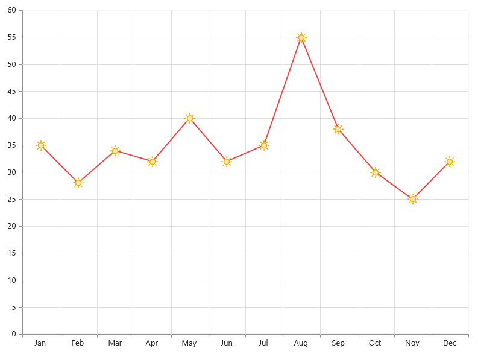
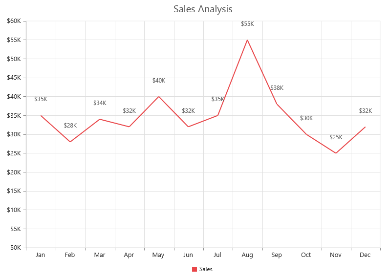
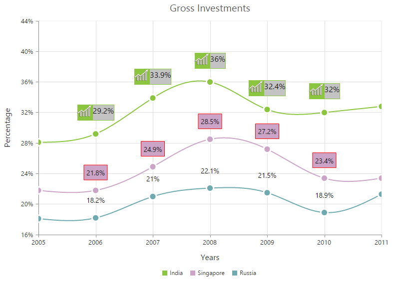
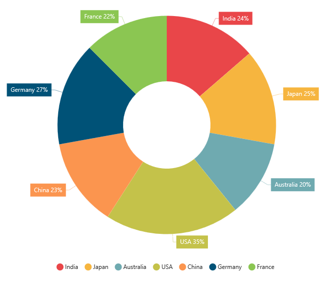
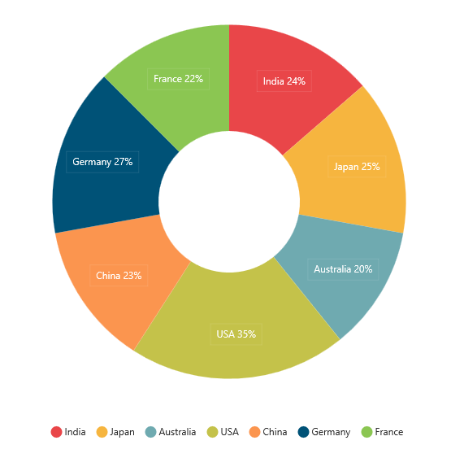
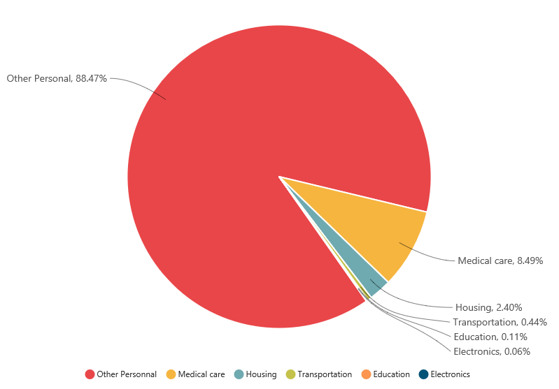

# Data Markers

Data markers are used to provide information about the data point to the user. You can add a shape and label to adorn each data point.

## Add Shapes

You can add shapes to any chart types but they are often used with line, area and spline series to indicate each data point. It is highlighted when you hover the mouse on the shape.

Shapes can be added to the chart by enabling the [`visible`] option of the [`marker`] property. There are different shapes you can add to the chart by using the shape option such as rectangle, circle, diamond etc.

The following code example explains on how to enable series marker and add shapes,



  <ej-chart id="chartcontainer">
     <e-seriescollection>
        <e-series [marker.visible]="true" marker.shape="diamond">
	    </e-series>
        <e-series [marker.visible]="true" marker.shape="Triangle">
	    </e-series>
        <e-series [marker.visible]="true" marker.shape="Hexagon">
	    </e-series>
     </e-seriescollection>
   </ej-chart>



## Add image as marker

Apart from the shapes, you can also add images to mark the data point by using the [`imageUrl`] option.

The following code example illustrates this,



  <ej-chart id="chartcontainer">
     <e-seriescollection>
        <e-series marker.shape="image"  marker.imageUrl="sun_annotation.png" [marker.size.width]=20 [marker.size.height]=20>
	    </e-series>
     </e-seriescollection>
   </ej-chart>



## Add labels

Data label can be added to a chart series by enabling the [`visible`] property in the [`dataLabel`] option. The labels appear at the top of the data point, by default.

The following code example shows how to enable data label and set its horizontal and vertical text alignment. 



  <ej-chart id="chartcontainer">
     <e-seriescollection>
        <e-series marker.horizontalTextAlignment="center"  marker.verticalTextAlignment="far.png">
	    </e-series>
     </e-seriescollection>
   </ej-chart>



Label content can be formatted by using the template option. Inside the template, you can add the placeholder text *"point.x"* and *"point.y"* to display corresponding data points x & y value.

You can adorn the labels with background shapes by setting *shape* option.

The following code example shows how to add background shapes and set template to data label.



     

	
     

     

          
#point.y#%

     

  <ej-chart id="chartcontainer">
     <e-seriescollection>
        <e-series [marker.dataLabel.visible]="true" marker.dataLabel.template="template">
	    </e-series>
        <e-series [marker.dataLabel.visible]="true" marker.dataLabel.shape="rectangle">
	    </e-series>
        <e-series [marker.dataLabel.visible]="true">
	    </e-series>
     </e-seriescollection>
   </ej-chart>





The appearance of the labels can be customized by using the [`font`] and [`offset`] options. The [`offset`] option is used to move the labels vertically. Also, labels can be rotated by using the [`rotate`] option.

The following code example shows how to rotate datalabel text and customize the font.



  <ej-chart id="chartcontainer">
     <e-seriescollection>
        <e-series [marker.dataLabel.angle]=300 [marker.dataLabel.offset]=15 [marker.dataLabel.font]="{ color: 'black', size:'13px' }">
	    </e-series>
     </e-seriescollection>
   </ej-chart>



You can position the label to the top, center or bottom position of the segment by using the [`textPosition`] option for the chart types such as column, bar, stacked bar, stacked column, 100% stacked bar, 100% stacked column, candle and OHLC.

The following code example shows how to set textPosition to display data label in the middle of the column rectangle.



  <ej-chart id="chartcontainer">
     <e-seriescollection>
       <!-- Place the datalabel text position in the centre of the rectangle-->
        <e-series marker.dataLabel.textPosition="middle">
	    </e-series>
     </e-seriescollection>
   </ej-chart>



The label can be positioned inside or outside the perimeter of the series by using the [`labelPosition`] option for the chart types such as Pie and Doughnut, .

The following code example shows how to set the *labelPosition*,



  <ej-chart id="chartcontainer">
     <e-seriescollection>
        <e-series type="doughnut" labelPosition="outside" [marker.dataLabel.visible]="true" marker.dataLabel.shape="rectangle">
         <e-points>
		 <e-point x="India" [y]="24" text='India 24%'></e-point>
		 <e-point x="Japan" [y]="25"  text='Japan 25%'></e-point>
		 <e-point x="Australia" [y]="20" text='Australia 20%'></e-point>
		 <e-point x="USA" [y]="35" text='USA 35%'></e-point>
		 <e-point x="China" [y]="23" text='China 23%'></e-point>
		 <e-point x="Germany" [y]="27" text='Germany 27%'></e-point>
		 <e-point x="France" [y]="22" text='France 22%'></e-point>
         </e-points>
	    </e-series>
     </e-seriescollection>
   </ej-chart>

 

The following screenshot displays the labels when the [`labelPosition`] is set as *inside* position.

The following screenshot displays the labels when the [`labelPosition`] is set as *outsideExtended* position.

The label can be wrapped for pie, doughnut, funnel, and pyramid series by setting the enableWrap property. 

 

  <ej-chart id="chartcontainer">
     <e-seriescollection>
        <!-- enable wrap and set the maximumLabelWidth of the data label -->
        <e-series type="doughnut" [marker.dataLabel.visible]="true" [marker.dataLabel.enableWrap]="true" [marker.dataLabel.maximumLabelWidth]=32>
         <e-points>
		  <!-- add point here -->
         </e-points>
	    </e-series>
     </e-seriescollection>
   </ej-chart>

 

## Customize specific points

By using the ejChart, you can also customize the individual/specific markers with different colors, shapes and also with different images.

There are two ways to achieve this based on how the data is fed to the series.

When the data is provided by using the [`points`] option, you can add marker for each data point or specific point by using the [`marker`] option as illustrated in the following code example.



    this.marker1= {         
      //Enable and customize the data label for a point
                         dataLabel: {
                                visible: true,
                                offset: -10,
                                shape: "upArrow", font: { color: "white" , size: '11px' },
                                margin: { left: 15, right: 15, top: 10, bottom: 10 },
                                fill: "green"
                           } };
      this.marker2= {
         //Enable and customize the data label for a point
                     dataLabel: {
                                        visible: true,
                                        offset: -22,
                                        verticalTextAlignment: 'near',
                                        shape: "downArrow", font: { color: "white", size: '11px' },
                                        margin: { left: 15, right: 15, top: 10, bottom: 10 },                    
                                        fill: "red"
                           } };





  <ej-chart id="chartcontainer">
     <e-seriescollection>
        <e-series>
         <e-points>
         <e-point x="Jan" [y]="35"></e-point>
		 <e-point x="Feb" [y]="28"></e-point>
		 <e-point x="Mar" [y]="34"></e-point>
		 <e-point x="Apr" [y]="32"></e-point>
         <e-point x="May" [y]="40"></e-point>
         <e-point x="Jun" [y]="32"></e-point>
         <e-point x="Jul" [y]="35"></e-point>
         <e-point x="Aug" [y]="55" [marker]="marker1"></e-point>
		 <e-point x="Sep" [y]="38"></e-point>
		 <e-point x="Oct" [y]="30"></e-point>
		 <e-point x="Nov" [y]="25" [marker]="marker2"></e-point>
		 <e-point x="Dec" [y]="32" ></e-point>
         </e-points>
	    </e-series>
     </e-seriescollection>
   </ej-chart>



When the data is bound to the series by using the [`dataSource`] option, you can customize the points in the [`seriesRendering`] event as illustrated in the following code example,



  <ej-chart id="chartcontainer" (seriesRendering)="onSeriesRender($event)">
     <e-seriescollection>
        <e-series [dataSource]="chartData" xName="month" yName="sales">
	    </e-series>
     </e-seriescollection>
   </ej-chart>





    //Define the seriesRendering client side event
  
     function onSeriesRender(sender) {
 
        
        //Enable and customize the dataLabel for a point using event

            sender.data.series.points[7].marker = {
               dataLabel: {
                    visible: true,
                    offset: -10,
                    shape: "upArrow", font: { color: "white", size: '11px' },
                    margin: { left: 15, right: 15, top: 10, bottom: 10 },                    
                    fill: "green"
                }};

            sender.data.series.points[10].marker = {
                 //Enable and customize the dataLabel for a point using event
                dataLabel: {
                        visible: true,
                        offset: -22,
                        verticalTextAlignment: 'near',
                        shape: "downArrow", font: { color: "white", size: '11px' },
                        margin: { left: 15, right: 15, top: 10, bottom: 10 },                    
                        fill: "red"
                }};
        }



## Connect Line

This feature is used to connect label and data point by using a line. It can be enabled only for Pie, Doughnut, Pyramid and Funnel chart types. Connector line types can be set as *bezier* or *line* by using the [`type`] option.

 The following code example illustrates this,



             this.dataMarker= {
                   dataLabel: {
                             visible: true,
                             // Set connector line type and customize the color,
                             connectorLine: { type: 'bezier', color: 'black' }
                             // ...
                      }
                };
    




  <ej-chart id="chartcontainer">
     <e-seriescollection>
        <e-series labelPosition='outsideExtended' [marker]="dataMarker">
	    </e-series>
     </e-seriescollection>
   </ej-chart>



## Smart labels

Overlapping of the labels can be avoided by enabling the [`enableSmartLabels`] property. The default value is *true* for *accumulation type series* and *false* for *other series types*.

The following code example shows how to enable smart labels,



         this.dataMarker:{
		              dataLabel:{
				          visible: true,
				          shape: 'none',
				          connectorLine: { type: 'bezier', color: 'black' },
				          font: { size: '14px' }
                       }};





  <ej-chart id="chartcontainer">
     <e-seriescollection>
        <e-series [enableSmartLabels]='true' [marker]="dataMarker">
	    </e-series>
     </e-seriescollection>
   </ej-chart>
   


