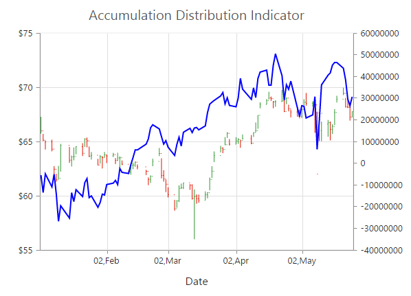
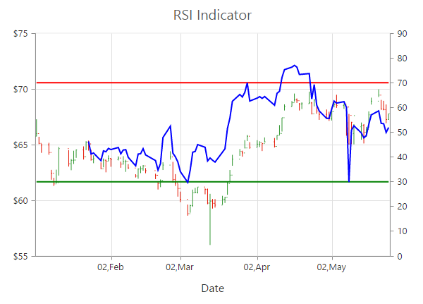

# Technical Indicators

EjChart control supports 10 types of technical indicators. 

## Bind data to render the indicator

You can bind the series `dataSource` to the indicator by setting the specific series name to the indicator by using the `indicators.seriesName` property.



this.chartindicators = [{
    //Set Hilo series dataSource to indicator using seriesName
    seriesName: "Hilo"
    //  ...
}];





<ej-chart id="chartcontainer" [indicators]="chartindicators">
    <e-seriescollection>
        <e-series type="hiloopenclose" name="Hilo" [dataSource]="chartData" 
             xName= "xDate" high="High" low="Low" open="Open" close="Close">
	    </e-series>
  </e-seriescollection>
</ej-chart>



Also, you can add data to the indicator directly by using the `dataSource` option of the indicator.  


   
this.chartindicators = [{
    //Add dataSource to indicator directly
    dataSource: chartData,
    xName: "xDate",
    high: "High",
    low: "Low",
    open: "Open",
    close: "Close",
    //  ...
}];





<ej-chart id="chartcontainer" [indicators]="chartindicators">
</ej-chart>


	
## Indicator Types

### Accumulation Distribution

To create an Accumulation Distribution indicator, set the `indicators.type` as **"accumulationdistribution"**. Accumulation Distribution require **‘volume’** field additionally with the `dataSource` to calculate the signal line.



//Initializing Indicators    
this.chartindicators = [{
    seriesName: "Hilo",
    //Set indicator type
    type: "accumulationdistribution",
    //  ...
}];





<ej-chart id="chartcontainer" [indicators]="chartindicators">
    <e-seriescollection>
        <e-series name="Hilo" [dataSource]="chartData" xName= "xDate"
            high="High"  low="Low" open="Open" close="Close" volume="Volume">
	    </e-series>
   </e-seriescollection>
   
</ej-chart>



### Average True Range (ATR)

You can create an ATR indicator by setting the `indicators.type` as **"atr"** in the `indicators`. 



//Initializing Indicators    
this.chartindicators = [{
    seriesName: "Hilo",
    //Set indicator type
    type: "atr",
    //  ...
}];





<ej-chart id="chartcontainer" [indicators]="chartindicators">
    <e-seriescollection>
        <e-series name="Hilo" [dataSource]="chartData" xName= "xDate"
                       high="High" low="Low" open="Open" close="Close">
	    </e-series>
   </e-seriescollection>   
</ej-chart>



### Bollinger Band 

Bollinger Band indicator is created by setting the `indicators.type` as **"bollingerband"**. It contains three lines, namely upper band, lower band and signal line. Bollinger Band default value of the period is 14 and standardDeviations is 2.



//Initializing Indicators    
this.chartindicators = [{
    seriesName: "Hilo",
    //Set indicator type
    type: "bollingerband",
    //  ...
}];





<ej-chart id="chartcontainer" [indicators]="chartindicators">
    <e-seriescollection>
        <e-series name="Hilo" [dataSource]="chartData" xName= "xDate"
         high="High" low="Low" open="Open" close="Close">
	    </e-series>
   </e-seriescollection>   
</ej-chart>



### Exponential Moving Average (EMA)

To render an EMA indicator, you have to set the `indicators.type` as **"ema"**.  



//Initializing Indicators    
this.chartindicators = [{
    seriesName: "Hilo",
    //Set indicator type
    type: "ema",
    //  ...
}];





<ej-chart id="chartcontainer" [indicators]="chartindicators">
    <e-seriescollection>
        <e-series name="Hilo" [dataSource]="chartData" xName= "xDate"
         high="High" low="Low" open="Open" close="Close">
	    </e-series>
   </e-seriescollection>   
</ej-chart>



### Momentum 

Momentum Technical indicator is created by setting the `indicators.type` as **"momentum"**. The momentum indicator renders two lines, namely upper band and signal line. Upper band always rendered at the value 100 and the signal line is calculated based on the momentum of the data.



//Initializing Indicators    
this.chartindicators = [{
    seriesName: "Hilo",
    //Set indicator type
    type: "momentum",
    //  ...
}];





<ej-chart id="chartcontainer" [indicators]="chartindicators">
    <e-seriescollection>
        <e-series name="Hilo" [dataSource]="chartData" xName= "xDate"
         high="High" low="Low" open="Open" close="Close">
	    </e-series>
   </e-seriescollection>   
</ej-chart>



### Moving Average Convergence Divergence (MACD)

To render an MACD indicator, you have to set the `indicators.type` as **"macd"**.  MACD indicator contains MACD line, Signal line and Histogram column. Histogram is used to differentiate MACD and signal line.



//Initializing Indicators    
this.chartindicators = [{
    seriesName: "Hilo",
    //Set indicator type
    type: "macd",
    //  ...
}];





<ej-chart id="chartcontainer" [indicators]="chartindicators">
    <e-seriescollection>
        <e-series name="Hilo" [dataSource]="chartData" xName= "xDate"
                    high="High" low="Low" open="Open" close="Close">
	    </e-series>
   </e-seriescollection>   
</ej-chart>



#### macdType

By using the `macdType` enumeration property, you can change the MACD rendering as *line*, *histogram* or *both*. 


         
//Initializing Indicators    
this.chartindicators = [{
    type: "macd",
    //Set macd draw type
    macdType: "histogram",
    //  ...
}];



### Relative Strength Index (RSI)

To render the RSI indicator, set the `indicators.type` as **"rsi"**. It contains three lines, namely upper band, lower band and signal line. Upper and lower band always render at value 70 and 30 respectively and signal line is calculated based on the **RSI** formula.



//Initializing Indicators    
this.chartindicators = [{
    seriesName: "Hilo",
    //Set indicator type
    type: "rsi",
    //  ...
}];





<ej-chart id="chartcontainer" [indicators]="chartindicators">
    <e-seriescollection>
        <e-series name="Hilo" [dataSource]="chartData" xName= "xDate"
                   high="High" low="Low" open="Open" close="Close">
	    </e-series>
   </e-seriescollection>   
</ej-chart>



### Simple Moving Average (SMA)

To render the SMA indicator, you should specify the `indicators.type` as **"sma"**.  



//Initializing Indicators    
this.chartindicators = [{
    seriesName: "Hilo",
    //Set indicator type
    type: "sma",
    //  ...
}];





<ej-chart id="chartcontainer" [indicators]="chartindicators">
    <e-seriescollection>
        <e-series name="Hilo" [dataSource]="chartData" xName= "xDate"
                   high="High" low="Low" open="Open" close="Close">
	    </e-series>
   </e-seriescollection>   
</ej-chart>



### Stochastic 

For the Stochastic indicator, you need to set the `indicators.type` as **"stochastic"**. The Stochastic indicator renders four lines namely, upper line, lower line, stochastic line and the signal line. Upper line always rendered at value 80 and the lower line is rendered at value 20. Stochastic and Signal Lines are calculated based on the stochastic formula.



//Initializing Indicators    
this.chartindicators = [{
    seriesName: "Hilo",
    //Set indicator type
    type: "stochastic",
    //  ...
}];





<ej-chart id="chartcontainer" [indicators]="chartindicators">
    <e-seriescollection>
        <e-series name="Hilo" [dataSource]="chartData" xName= "xDate"
                     high="High" low="Low" open="Open" close="Close">
	    </e-series>
   </e-seriescollection>   
</ej-chart>



### Triangular Moving Average (TMA)

To render the TMA indicator, you should specify the `indicators.type` as **"tma"**. 



//Initializing Indicators    
this.chartindicators = [{
    seriesName: "Hilo",
    //Set indicator type
    type: "tma",
    //  ...
}];





<ej-chart id="chartcontainer" [indicators]="chartindicators">
    <e-seriescollection>
        <e-series name="Hilo" [dataSource]="chartData" xName= "xDate"
                     high="High" low="Low" open="Open" close="Close">
	    </e-series>
   </e-seriescollection>   
</ej-chart>



## Enable Tooltip 

To display the indicator tooltip, use `visible` option of the `indicators.tooltip`. Also, you can change and customize the tooltip color, border, format and font properties similar to the series tooltip.


           
//Initializing Indicators    
this.chartindicators = [{
    //  ...
    tooltip: {
        //Enable tooltip for indicator
        visible: true
    },
}];



