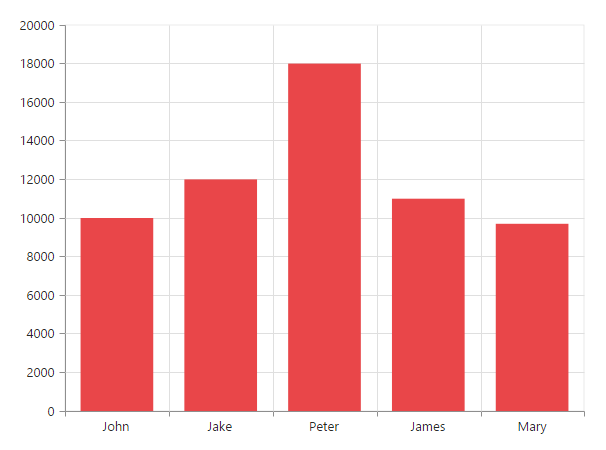

# Working with Data

## Local Data

There are two ways to provide local data to chart.

1. You can bind the data to the chart by using the **dataSource** property of the series and then you need to map the X and Y value with the **xName** and **yName** properties respectively.

N> For the **OHLC** type series, you have to map four dataSource fields (**high**, **low**, **open** and **close**) to bind the data source and for the **bubble** series you have to map the **size** field along with the **xName** and **yName**. 



<ej-chart id="container">
        <e-seriescollection >
            <e-series xName="ShipCity" [dataSource]="chartData" yName="Freight" >
            </e-series>
        </e-seriescollection>
</ej-chart>





this.chartData = [
    { ShipCity: "STOCKHOLM", Freight: 28 },
    { ShipCity: "MOSCOW", Freight: 148 },
    { ShipCity: "OTTAWA", Freight: 8 },
    { ShipCity: "KIEV", Freight: 43 },
    { ShipCity: "COPENHAGEN", Freight: 28 },
    { ShipCity: "Juneau", Freight: 35 },
    { ShipCity: "Resende", Freight: 13.97 },
    { ShipCity: "San Cristobal", Freight: 81.91 },

];



2.You can also plot data to chart using **points** option in the series. Using this property you can customize each and every point in the data.



    <ej-chart id="container">
        <e-seriescollection>
            <e-series>
                <e-points>
                    <e-point  x="John" y="10000"> </e-point>
                    <e-point  x="Jake" y="12000"> </e-point>
                    <e-point  x="Peter" y="18000"> </e-point>
                    <e-point  x="James" y="11000"> </e-point>
                    <e-point  x="Mary" y="10000"> </e-point>
                </e-points>
            </e-series>        
        </e-seriescollection>
    </ej-chart>



## Remote Data

You can bind the remote data to the chart by using the DataManager and you can use the **query** property of the series to filter the data from the dataSource.



        //Remote URL           
        var dataManger = new ej.DataManager({
            url: "http://mvc.syncfusion.com/Services/Northwnd.svc/"
        });
        // Query creation
        var query = ej.Query().from("Orders").take(6);
        var chart = $("#chartcontainer").ejChart("instance");
        chart.model.series[0].dataSource=dataManager;
        chart.model.series[0].query=query;
        chart.redraw();





<ej-chart id="container">
        <e-seriescollection>
            <e-series xName="ShipCity" yName="Freight">
            </e-series>        
        </e-seriescollection>
</ej-chart>



