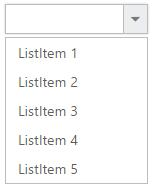

# Getting Started

The external script dependencies of the DropDownList widget are,

* [jQuery 1.7.1](http://jquery.com/) and later versions.
* [jQuery.easing](http://gsgd.co.uk/sandbox/jquery/easing/) - to support the animation effects.

And the internal script dependencies of the DropDownList widget are:

<table>
	<tr>
		<th>File </th>
		<th>Description / Usage </th>
	</tr>
	<tr>
		<td>ej.core.min.js</td>
		<td>Must be referred always before using all the JS controls.</td>
	</tr>
	<tr>
		<td>ej.data.min.js</td>
		<td>Used to handle data operation and should be used while binding data to JS controls.</td>
	</tr>
	<tr>
		<td>ej.dropdownlist.min.js</td>
		<td>The dropdownlist’s main file</td>
	</tr>
	<tr>
		<td>ej.checkbox.min.js</td>
		<td>Should be referred when using checkbox functionalities in DropDownList.</td>
	</tr>
	<tr>
		<td>ej.scroller.min.js</td>
		<td>Should be referred when using scrolling in DropDownList.</td>
	</tr>
	<tr>
		<td>ej.draggable.min.js</td>
		<td>Should be referred when using popup resize functionality in DropDownList.</td>
	</tr>
</table>

For getting started you can use the ‘ej.web.all.min.js’ file, which encapsulates all the 'ej' controls and frameworks in one single file.  

For themes, you can use the ‘ej.web.all.min.css’ CDN link from the snippet given. To add the themes in your application, please refer [this link](http://help.syncfusion.com/js/theming-in-essential-javascript-components#adding-specific-theme-to-your-application).

## Preparing HTML document

Create an HTML page and add the scripts references in the order mentioned in the following code example.



     <!DOCTYPE html>
     <html>
     <head> 
     <link href="//cdn.syncfusion.com/14.3.0.49/js/web/flat-azure/ej.web.all.min.css" rel="stylesheet" />
     
     
     
     
     
     
     
     
     
     
     </head>
     <body>
     <ej-app>Loading...</ej-app>
     </body>
     </html>



N> In the above code, `ej.web.all.min.js`script reference has been added for demonstration purpose. It is not recommended to use this for deployment purpose, as its file size is larger since it contains all the widgets. Instead, you can use [`CSG`](http://csg.syncfusion.com "CSG") utility to generate a custom script file with the required widgets for deployment purpose.

## Creating DropDownList in Angular2

The DropDownList can be created from a HTML ‘input’ element with the HTML 'id' attribute and pre-defined options set to it. To create the DropDownList, you should call the 'ejDropDownList' jQuery plug-in function.


	
	  <input id="dropdown1" ej-dropdownlist [dataSource]="data" [fields]="fieldsvalues" [(value)]="value"/>
			

	
	
	
		import {Component} from '@angular/core';

         @Component({
           selector: 'sd-home',
           templateUrl: 'app/components/dropdown/dropdown.component.html' //give the path file for dropdownlist component html file.
          })
          export class DropDownListComponent {
                data: Array<Object> = [];
                fieldsvalues: Object;
                value: string;
                constructor() {
                this.data = [
                    {text: "ListItem 1", value: "ListItem 1" },
                    {text: "ListItem 2", value: "ListItem 2" },
                    {text: "ListItem 3", value: "ListItem 3" },
                    {text: "ListItem 4", value: "ListItem 4" },
                    {text: "ListItem 5", value: "ListItem 5" },
            
                  ];
              this.fieldsvalues = { dataSource: this.data, text: "text", value: "value" };
              }
            }		
	


## Populating data

The DropDownList can be bounded to both local array and remote data services .You can bind data to DropDownList through services using  [dataSource](http://help.syncfusion.com/js/api/ejdropdownlist#members:datasource) property 
 


	 <input id="dropdown1" ej-dropdownlist [dataSource]="data" [fields]="fieldsvalues" [(value)]="value"/>
	

	
	
	
   import {Component,ViewEncapsulation} from '@angular/core';
   import {NorthwindService} from './services/northwind.service'; //path of your service 
      
	    @Component({
           selector: 'ej-app',
           templateUrl: 'app/app.component.html',
            providers:[NorthwindService]
             })
        export class AppComponent {
                public Data:any;
                public dataManager:any;
                fieldsvalues: Object;
	           constructor(private service:NorthwindService)
             {
         
              this.data = service.getEmployees();
              this.fieldsvalues = { dataSource: this.Data, text: "FirstName" };
             }
       
         }
	

	

## Setting Dimensions

DropDownList dimensions can be set using width and height API.
	

	
	<input id="bookSelect" ej-dropdownlist [dataSource]="data" [fields]="fieldsvalues" width="300px" height="50px"/>


	
**Setting dimensions to Popup list**

PopupWidth and popupHeight can be used to create a fixed size popup list.



	<input id="bookSelect" ej-dropdownlist [dataSource]="data" [fields]="fieldsvalues" width="300px" height="50px" popupWidth="300px" popupHeight="200px"/>


	
## Setting and Getting Value

You can select single or multiple values from DropDownList widget. To assign a value initially to the DropDownList, you can use [value](http://help.syncfusion.com/js/api/ejdropdownlist#members:value) property.

N> To select multiple items based on index, refer [here](functionalities#selection).



	<input id="bookSelect" ej-dropdownlist [dataSource]="data" [fields]="fieldsvalues" [(value)]="value" (change)="onChange($event)" width="300px" height="50px" popupWidth="300px" popupHeight="100px"/>


	
	
	
      import {Component, ViewEncapsulation} from '@angular/core';

	    @Component({
           selector: 'ej-app',
           templateUrl: 'app/app.component.html',
   
                   })
        export class AppComponent {
              data: Array<Object> = [];
                fieldsvalues: Object;
                value: string;
                constructor() {
                this.data = [
                    {text: "ListItem 1", value: "ListItem 1" },
                    {text: "ListItem 2", value: "ListItem 2" },
                    {text: "ListItem 3", value: "ListItem 3" },
                    {text: "ListItem 4", value: "ListItem 4" },
                    {text: "ListItem 5", value: "ListItem 5" },
            
                  ];
              this.fieldsvalues = { dataSource: this.data, text: "text", value: "value" };
              this.value = "ListItem 1";
              }
			  onChange(event)
			  {
			   var obj = $('#dropdown1').data("ejDropDownList");
				console.log("Selected Item's Text - " + obj.option("text"));
				console.log("selected Item's Value - " + obj.option("value"));      
			  }

            }


