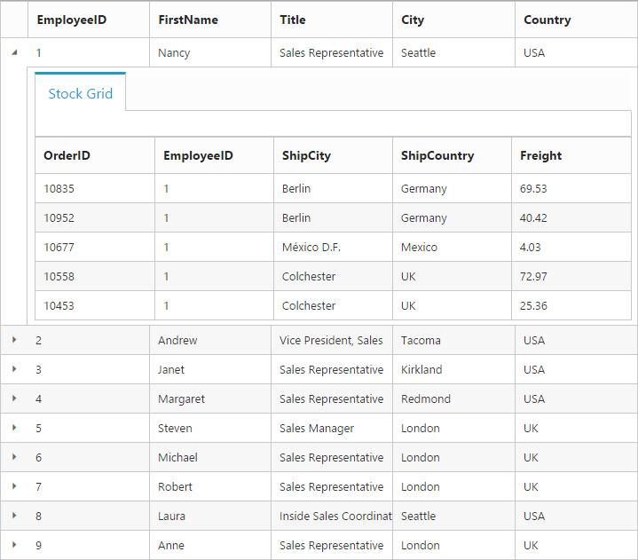

---
layout: post
title: Row with Grid widget for Syncfusion Essential Angular-2
description: How to use and customize the grid row
platform: angular-2
control: Grid
documentation: ug
--- 
# Row

It represents the record details that are fetched from the datasource.

## Details Template

It provides a detailed view /additional information about each row of the grid. You can render any type of JsRender template and assign the script template id in the `detailsTemplate` property. And also you can change HTML elements in detail template row into JavaScript controls using `detailsDataBound` event.

On enabling details template, new column will be added in grid with an expander button in it and that can be expanded or collapsed to show or hide the underlying details row respectively.

N> It's a standard way to enclose the template within the `script` tag with `type` as "text/x-jsrender".

The following code example describes the above behavior.



 <ej-grid id="Grid" [dataSource]="gridData" allowPaging="true" [detailsTemplate]="detailTemp" (detailsDataBound)="detailsDataBound($event)">
    <e-columns>
        <e-column field="EmployeeID" headerText="EmployeeID"></e-column>
        <e-column field="FirstName" headerText="FirstName"></e-column>
        <e-column field="Title" headerText="Title"></e-column>
        <e-column field="City" headerText="City"></e-column>
        <e-column field="Country" headerText="Country"></e-column>
    </e-columns>
 </ej-grid>





    import {Component, ViewEncapsulation} from '@angular/core';
    @Component({
      selector: 'ej-app',
      templateUrl: 'app/app.component.html',  //give the path file for Grid control html file.
    })
    export class AppComponent {
        public gridData;
        public detailTemp;
        detailsDataBound(e: any) { 
                 // Here you can get the parent details from "data". EmployeeID is the unique column value in parent row.
              var filteredData = e.data["EmployeeID"];
                 // the datasource "window.ordersView" is referred from 'http://js.syncfusion.com/demos/web/scripts/jsondata.min.js'
              var data = ej.DataManager(window.ordersView).executeLocal(ej.Query().where("EmployeeID", "equal", parseInt(filteredData), true).take(5)); // form the query to filter the detail row data by using EmployeeID column value.
                 //detailsElement contains all the elements which are mentioned in the template.
                 // Here the detailGrid element is changed as ejGrid control
              e.detailsElement.find("#detailGrid").ejGrid({
              dataSource: data,
              columns: ["OrderID", "EmployeeID", "ShipCity", "ShipCountry", "Freight"]
             });
             // Here the element which has tabcontrol class is changed as ejTab control
             e.detailsElement.find(".tabcontrol").ejTab();
           }
         constructor()
         {
           //The datasource "window.employeeView" is referred from 'http://js.syncfusion.com/demos/web/scripts/jsondata.min.js'
           this.gridData = window.employeeView;
           this.detailTemp = "#tabGridContents";
		 }
     }



Place the js-render template in the "index.html" page.





The following output is displayed as a result of the above code example.

## Row Template

Row template enables you to set the customized look and behavior to grid all rows. `rowTemplate` property can be used bind the `id` of HTML template.

The following code example describes the above behavior.



<ej-grid id="Grid" [dataSource]="gridData" allowScrolling="true" [scrollSettings]="scrollSettings" [rowTemplate]="template">
    <e-columns>
        <e-column field="photo" headerText="Photo" width="30"></e-column>
	    <e-column headerText="Employee Details" width="70"></e-column>
     </e-columns>
</ej-grid>


  


    import {Component, ViewEncapsulation} from '@angular/core';
    @Component({
      selector: 'ej-app',
      templateUrl: 'app/app.component.html',  //give the path file for Grid control html file.
    })
    export class AppComponent {
        public gridData;
        public template;
        public scrollSettings;
    	constructor()
        {
           //The datasource "window.employeeView" is referred from 'http://js.syncfusion.com/demos/web/scripts/jsondata.min.js'
           this.gridData = window.employeeView;
           this.template = "#templateData";
		   this.scrollSettings = { width: 500, height: 380 };
	    }
     }



Place the js-render template in the "index.html" page.



 
 


  



   
The following output is displayed as a result of the above code example.

