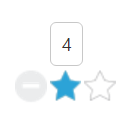
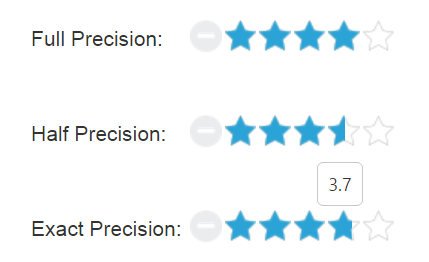
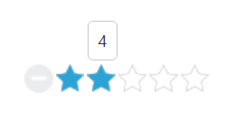
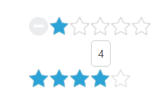

# Rating Customization

## Setting Value

The **Value** property sets the display value of the Rating. For example, when the [Value](https://help.syncfusion.com/api/js/ejrating#members:value) property is set to be **four**, the Rating control renders four ratings. By default, [Value](https://help.syncfusion.com/api/js/ejrating#members:value) property’s value is **one**.

The following code example is used to render the **Rating** control with customized value.

 Add the following HTML to render Rating with customized value.



<ej-rating id="rating" [value]="ratingValue"></ej-rating>





import { Component } from '@angular/core';
@Component({
    selector: 'ej-app',
    templateUrl: 'src/rating/rating.component.html'
})
export class RatingComponent {
    ratingValue: number;
    constructor() {
        this.ratingValue = 4;
    }
}



The following screenshot illustrates the **Rating** with custom defined value.

 

### Min Value

**EJ Rating** control provides support for setting [minimum value](https://help.syncfusion.com/api/js/ejrating#members:minvalue). This is achieved by adding minValue property. When the minValue property is set, the Rating value starts with **minValue**+1.

The following code example is used to render the **Rating** control with **minimum** **rating**.

 Add the following HTML to render Rating with minimum value.



 <ej-rating id="rating" [minValue]="minvalue"></ej-rating>





import { Component } from '@angular/core';
@Component({
    selector: 'ej-app',
    templateUrl: 'src/rating/rating.component.html'
})

export class RatingComponent {
    minvalue: number;
    constructor() {
        this.minvalue = 3;
    }
}



The following screenshot illustrates **Rating** with **minimum** **value**.         

 

### Max Value

**EJ** **Rating** **control** provides support for setting [maximum value](https://help.syncfusion.com/api/js/ejrating#members:maxvalue). This is achieved by adding the **maxValue** property**.** By default, maxValue is five.

The following code example is used to render the Rating control with **maximum** **rating**.

 Add the following HTML to render Rating with maximum value.



 <ej-rating id="rating" [maxValue]="maxvalue"></ej-rating>





import { Component } from '@angular/core';
@Component({
    selector: 'ej-app',
    templateUrl: 'src/rating/rating.component.html'
})

export class RatingComponent {
    maxvalue: number;
    constructor() {
        this.maxvalue = 10;
    }
}



The following screenshot illustrates the **Rating** with **maximum** **value**.

 

## Set Precision

In a real-time movie **Rating** scenario, you can set **Precision** between two whole numbers such as 2.5 or 3.7 and it is done using the [Precision](https://help.syncfusion.com/api/js/ejrating#members:precision) by changing the value to **ej.Rating.Precision.Half** or **ej.Rating.Precision.Exact.** By default, **Precision** is **Full.**

The following code example is used to render the **Rating** control with **Precision**.

 Add the following HTML to render Rating with Precision.



<table>
	<tr>
		<td valign="top">Full Precision:
		</td>
		<td>
		<ej-rating  id="rating" [value]="rate"></ej-rating> 
		</td>
	</tr>   
	<tr>
		<td valign="top">Half Precision:
		</td>
		<td>
		<ej-rating  id="halfRating" [precision]="halfprecision" [value]="halfvalue"></ej-rating>                
		</td>
	</tr>  
	<tr>
		<td valign="top">Exact Precision:
		</td>
		<td>
		<ej-rating  id="exactRating" [precision]="exactprecision" [value]="exactvalue"></ej-rating>     
		</td>
	</tr>         
</table>

    




import { Component } from '@angular/core';
@Component({
    selector: 'ej-app',
    templateUrl: 'src/rating/rating.component.html'
})

export class RatingComponent {
    rate: number;
    halfvalue: number;
    exactvalue: number;
    halfprecision: any;
    exactprecision: any;
    constructor() {
        this.rate = 4;
        this.halfvalue = 3.5;
        this.exactvalue = 3.7;
        this.halfprecision = ej.Rating.Precision.Half;
        this.exactprecision = ej.Rating.Precision.Exact;
    }
}



The following screenshot illustrates the **Rating** with **Precision**.

 

## Increment Step

**EJ Rating** control supports customized **increment** value for Rating. This is achieved by adding the [incrementStep](https://help.syncfusion.com/api/js/ejrating#members:incrementstep) property.

The following code example is used to render the **Rating** control with customized **increment**.

 Add the following HTML to render Rating with customized increment.



<ej-rating id="rating" [maxValue]="maxvalue" [incrementStep]="increment"></ej-rating>





import { Component } from '@angular/core';
@Component({
    selector: 'ej-app',
    templateUrl: 'src/rating/rating.component.html'
})

export class RatingComponent {
    maxvalue: number;
    increment: number;
    constructor() {
        this.maxvalue = 10;
        this.increment = 2;
    }
}



The following screenshot illustrates the **Rating** with customized increment.

 

## Resetting values

**EJ Rating** control provides support for value **reset** at runtime. This is achieved by enabling the [allowReset](https://help.syncfusion.com/api/js/ejrating#members:allowreset) property to be **‘True’.** By default, the property value is set to **‘True’.**

The following code example is used to render the **Rating** control with **allowReset**.

 Add the following HTML to render Rating with allowReset.



    <table>
        <tr>
            <td valign="top">Rating:
            </td>
            <td>
                 <ej-rating id="rating" [allowReset]="true"></ej-rating>
            </td>
        </tr>
        <tr>
            <td valign="top">Rating:
            </td>
            <td>
                 <ej-rating id="rating" [allowReset]="false"></ej-rating>
            </td>
        </tr>
    </table>



The following screenshot illustrates the **Rating** with **allowReset**.

 

## Read only

**Rating** control provides support for changeable or unchangeable values for **Rating** control. This is achieved by the [readOnly](https://help.syncfusion.com/api/js/ejrating#members:readonly) property. When this property is set to **‘True’** the **Rating** value becomes unchangeable. By default, this property value is set to **‘False’.**

The following code example is used to render the **Rating** control with **readOnly**.

 Add the following HTML to render Rating with readOnly.



 <ej-rating id="rating" [readOnly]="true"></ej-rating>
          


The following screenshot illustrates the **Rating** with **readOnly.**

 

## Enable or Disable

**Rating** control provides support to **enable** or **disable** the control. This is achieved by the [enabled](https://help.syncfusion.com/api/js/ejrating#members:enabled) property. By default the property value is **‘True’.**

The following code example is used to render the **Rating** control with **enable** or **disable** support.

 Add the following HTML to render Rating with enable or disable support.



    <table>
        <tr>
            <td valign="top">Rating:
            </td>
            <td>
                 <ej-rating id="rating" [enabled]="false"></ej-rating>
            </td>
        </tr>
    </table>

    


The following screenshot illustrates the **Rating** in **disabled** form.

