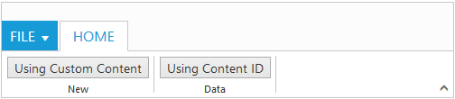
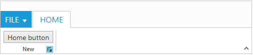

# Group

[`Group`](http://help.syncfusion.com/api/js/ejribbon#members:tabs-groups) is a collection of logical content groups that are combined under related Tab. Each group can be defined using content groups or custom content.

## Adding Tab Groups

Group items can be added to Tabs by specifying [`text`](http://help.syncfusion.com/api/js/ejribbon#members:tabs-groups-text) and corresponding [`content`](http://help.syncfusion.com/api/js/ejribbon#members:tabs-groups-content) to be displayed. The content of group can be specified as either with [`content`](http://help.syncfusion.com/api/js/ejribbon#members:tabs-groups-content) collection, [`contentID`](http://help.syncfusion.com/api/js/ejribbon#members:tabs-groups-contentid) or [`customContent`](http://help.syncfusion.com/api/js/ejribbon#members:tabs-groups-customcontent).

### Adding Content

Add content to Group item which is based on [`type`](http://help.syncfusion.com/api/js/ejribbon#members:tabs-groups-type) of content specified. The available types are `button`, `splitButton`, `toggleButton`,`gallery`, and `dropDownList`.

Groups and defaults settings can be added with the [`content`](http://help.syncfusion.com/api/js/ejribbon#members:tabs-groups-content).

#### _Defaults_

The `height`, `width`, `type`, `isBig` property to the controls in the [`group`](http://help.syncfusion.com/api/js/ejribbon#members:tabs-groups-content-groups) can be specified commonly.
The `height` & `width` applicable to button, split button, dropdown list ,Toggle button controls and `isBig` applicable to only button controls ( button, split , toggle)

#### _Enable Separator_ 

Separates the control from the next control in the group when group `alignType` is `row`. Set “true” to [`enableSeparator`](http://help.syncfusion.com/api/js/ejribbon#members:tabs-groups-content-groups-enableseparator).



<ej-ribbon id="Default" width="500px" applicationTab.type="menu" applicationTab.menuItemID="ribbonmenu">
   <e-tabs>
        <e-tab id="home" text="HOME" [groups]="groups1">
        </e-tab>
   </e-tabs>
</ej-ribbon>
<ul id="ribbonmenu">
   <li>
        <a>FILE </a>
        <ul>
            <li><a>New</a></li>
            <li><a>Open</a></li>
        </ul>
   </li>
</ul> 





import {Component} from '@angular/core';
import {NorthwindService} from '../../services/northwind.service';

@Component({
  selector: 'sd-home',
  templateUrl: 'app/components/ribbon/ribbon.component.html',
  providers: [NorthwindService]
})
export class RibbonComponent {
    constructor(public northwindService: NorthwindService) {}

groups1 = [{
        text: "New",
        alignType: "rows",
        content: [{
            groups: [{
                id: "new",
                text: "New",
                toolTip: "New",
                enableSeparator: true,
                buttonSettings: {
                    width: 100,
                }
                }, {
                    id: "font",
                    text: "Font",
                    toolTip: "Font",
                    buttonSettings: {
                        width: 150,
                    }
                }],
            defaults: {
                type: "button",
                height: 70
            }
        }]
   }]
  }    


### Adding Custom Content 

Set group [`type`](http://help.syncfusion.com/api/js/ejribbon#members:tabs-groups-type) as `custom` to add custom items such as div, table and custom controls. With type as custom, content can be added in two ways as specified below.

*	HTML contents can be directly added into the groups as string content using [`customContent`](http://help.syncfusion.com/api/js/ejribbon#members:tabs-groups-customcontent) property
*	Custom template id can be specified to render those specific custom template using [`contentID`](http://help.syncfusion.com/api/js/ejribbon#members:tabs-groups-contentid) property



<ej-ribbon id="Default" width="500px" applicationTab.type="menu" applicationTab.menuItemID="ribbonmenu">
    <e-tabs>
        <e-tab id="home" text="HOME" [groups]="groups1">
        </e-tab>
    </e-tabs>
</ej-ribbon>

<ul id="ribbonmenu">
    <li>
        <a>FILE </a>
        <ul>
            <li><a>New</a></li>
        </ul>
    </li>
</ul>
<button id="btn">Using Content ID</button>





import {Component} from '@angular/core';
import {NorthwindService} from '../../services/northwind.service';

@Component({
  selector: 'sd-home',
  templateUrl: 'app/components/ribbon/ribbon.component.html',
  providers: [NorthwindService]
})
export class RibbonComponent {
    constructor(public northwindService: NorthwindService) {}

groups1 = [{
        text: "New",
        type: "custom",
        customContent: "<button id='customContent'>Using Custom Content</button>"
     }, {
         text: "Data",
         type: "custom",
         contentID: "btn"
     }]
  }
      


## Group Expander

Set [`enableGroupExpander`](http://help.syncfusion.com/api/js/ejribbon#members:tabs-groups-enablegroupexpander) as true to show Group Expander for each group in Tab. These expanders can be customized using [`groupExpand`](http://help.syncfusion.com/api/js/ejribbon#events:groupexpand) event, such as to show popup dialog.



<ej-ribbon id="Default" width="500px" applicationTab.type="menu" applicationTab.menuItemID="ribbonmenu">
    <e-tabs>
        <e-tab id="home" text="HOME" [groups]="groups1">
        </e-tab>
    </e-tabs>
</ej-ribbon>
<ul id="ribbonmenu">
    <li>
        <a>FILE </a>
        <ul>
            <li><a>New</a></li>
        </ul>
    </li>
</ul>
<button id="btn">Home button</button>





import {Component} from '@angular/core';
import {NorthwindService} from '../../services/northwind.service';

@Component({
  selector: 'sd-home',
  templateUrl: 'app/components/ribbon/ribbon.component.html',
  providers: [NorthwindService]
})
export class RibbonComponent {
    constructor(public northwindService: NorthwindService) {}
    
       groups1 = [{
        text: "New",
        alignType: "rows",
        type: "custom",
        enableGroupExpander: true,
        contentID: "btn"
    }]
  }


