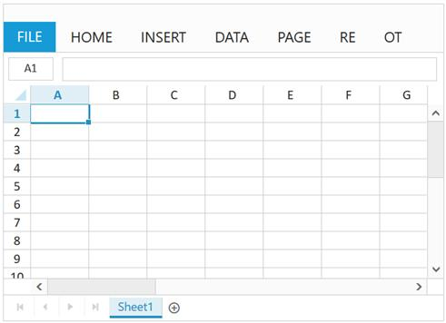
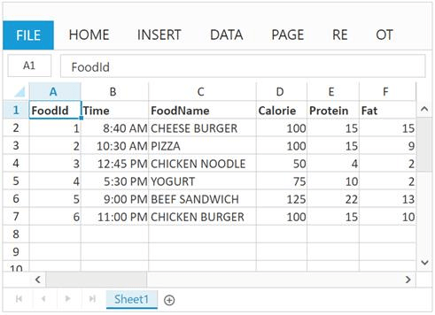
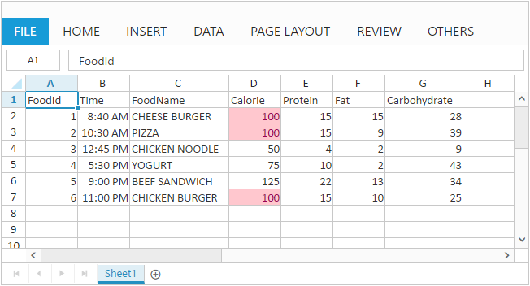

# Getting started

This section explains you the steps required to populate the Spreadsheet with data, format, and export it as excel file. This section covers only the minimal features that you need to know to get started with the Spreadsheet.

## Adding Script Reference

Create an HTML page and add the scripts references in the order mentioned in the following code example.



<!DOCTYPE html>
<html>
   <head> 
    <link href="//cdn.syncfusion.com/14.3.0.49/js/web/flat-azure/ej.web.all.min.css" rel="stylesheet" />
    
    
    
    
    
    
    
    
    
    
  </head>
  <body>
   <ej-app>Loading...</ej-app>
  </body>
</html>



In the above code, `ej.web.all.min.js`script reference has been added for demonstration purpose. It is not recommended to use this for deployment purpose, as its file size is larger since it contains all the widgets. Instead, you can use[`CSG`](http://csg.syncfusion.com "CSG")utility to generate a custom script file with the required widgets for deployment purpose.

N> For details about Spreadsheet internal and external dependencies refer following [`link`](http://help.syncfusion.com/js/spreadsheet/dependencies "link")

## Initialize Spreadsheet

In the `spreadsheet` component HTML file.



<ej-spreadsheet id="spreadsheet">
</ej-spreadsheet>



Initialize the Spreadsheet by using the ejSpreadsheet method. The Spreadsheet is rendered based on default `width` and `height`. You can also customize the Spreadsheet dimension by setting the [`width`](http://help.syncfusion.com/js/api/ejspreadsheet#members:scrollsettings-width "width") and [`height`](http://help.syncfusion.com/js/api/ejspreadsheet#members:scrollsettings-height "height") property in [`scrollSettings`](http://help.syncfusion.com/js/api/ejspreadsheet#members:scrollsettings "scrollSettings").



import {Component, ViewEncapsulation} from '@angular/core';
@Component({
  selector: 'ej-app',
  templateUrl: 'app/app.component.html',  //give the path file for spreadsheet component html file.
})
export class AppComponent {
    }


Now, the Spreadsheet is rendered with default row and column count.

## Populate Spreadsheet with data

Now, this section explains how to populate JSON data to the Spreadsheet. You can set [`dataSource`](http://help.syncfusion.com/js/api/ejspreadsheet#members:sheets-datasource "dataSource") property in [`sheet`](http://help.syncfusion.com/js/api/ejspreadsheet#members:sheets "sheet") settings to populate JSON data in Spreadsheet.



<ej-spreadsheet id="spreadsheet">
    <e-sheets>
        <e-sheet>
            <e-rangesettings>
                <e-rangesetting [dataSource]="spreadData" startCell="A1" [headerStyles]="{'font-weight':'bold'}"></e-rangesetting>
            </e-rangesettings>
        </e-sheet>
    </e-sheets>
</ej-spreadsheet>

import {Component, ViewEncapsulation} from '@angular/core';
import {NorthwindService} from './services/northwind.service';
@Component({
  selector: 'ej-app',
  templateUrl: 'app/app.component.html',  //give the path file for spreadsheet control html file.
  providers:[NorthwindService]
})
export class AppComponent {
    public spreadData;
    constructor(public northwindService: NorthwindService) {
    this.spreadData = ej.DataManager(northwindService.getFoodInformation()).executeLocal(ej.Query().take(50).select("FoodId", "Time", "FoodName", "Calorie", "Protein", "Fat", "Carbohydrate"));
    }
}



N> For more details about `data binding` refer following [`link`](http://help.syncfusion.com/js/spreadsheet/data-binding "link")

## Apply Conditional Formatting

Conditional formatting helps you to apply formats to a cell or range with certain color based on the cells values. You can use [`allowConditionalFormats`](http://help.syncfusion.com/js/api/ejspreadsheet#members:allowconditionalformats "allowConditionalFormats") property to enable/disable Conditional formats.

To apply conditional formats for a range use [`setCFRule`](http://help.syncfusion.com/js/api/ejspreadsheet#methods:xlcformat-setcfrule "setCFRule") method. The following code example illustrates this,



<ej-spreadsheet id="spreadsheet" (loadComplete)= loadComplete($event)>

import {Component, ViewEncapsulation} from '@angular/core';
import {NorthwindService} from './services/northwind.service';
@Component({
  selector: 'ej-app',
  templateUrl: 'app/app.component.html',  //give the path file for spreadsheet control html file.
  providers:[NorthwindService]
})
export class AppComponent {
  loadComplete(event) {
     let xlObj = $("#spreadsheet").data("ejSpreadsheet");
     xlObj.XLCFormat.setCFRule({ "action": "equalto", "inputs": ["100"], "color":   "redft", "range": "D1:D7" });
     }
}



N> For more details about `Conditional Formatting` refer following [`link`](http://help.syncfusion.com/js/spreadsheet/data-presentation#conditional-formatting "link")

## Export Spreadsheet as Excel File

The Spreadsheet can save its data, style, format into an excel file. To enable save option in Spreadsheet set [`allowExporting`](http://help.syncfusion.com/js/api/ejspreadsheet#members:exportsettings-allowexporting "allowExporting") option in [`exportSettings`](http://help.syncfusion.com/js/api/ejspreadsheet#members:exportsettings "exportSettings") as `true`. Since Spreadsheet uses server side helper to save documents set [`excelUrl`](http://help.syncfusion.com/js/api/ejspreadsheet#members:exportsettings-excelurl "excelUrl") in [`exportSettings`](http://help.syncfusion.com/js/api/ejspreadsheet#members:exportsettings "exportSettings") option. The following code example illustrates this,



<ej-spreadsheet id="spreadsheet"  exportSettings.excelUrl="http://js.syncfusion.com/demos/ejservices/api/JSXLExport/ExportToExcel" >
</ej-spreadsheet>



Use shortcut [`Ctrl + S`](http://help.syncfusion.com/js/spreadsheet/keyboard-shortcuts "Ctrl + S") to save Spreadsheet as excel file.

N> 1. For more details about `Export` refer following [`link`](http://help.syncfusion.com/js/spreadsheet/open-and-save#save "link")
N> 2. For more details about `Server Configuration` refer following [`link`](http://help.syncfusion.com/js/spreadsheet/open-and-save#server-configuration "link")
