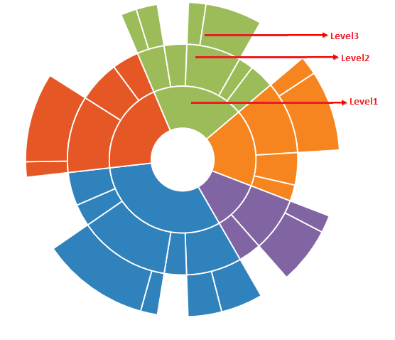

## Levels

Sunburst chart is used to display hierarchical data. You can add more than one hierarchical data by using the `levels` property of Sunburst chart. Each level of the hierarchy is represented by circle.
The following code snippet illustrates 



<ej-sunburstchart  id="sunburst"   [levels]="levels">
</ej-sunburstchart>



## GroupMemberPath

It is the string property that is used to map the group category value in the dataSource .
You can define the levels as shown in the below code example



<ej-sunburstchart  id="sunburst"   [levels]="levels">
</ej-sunburstchart>





import { Component, ViewEncapsulation} from '@angular/core';
import { DataService} from '../service/data.service';

@Component({
selector:"ej-app",
templateUrl:"src/sunburstchart/sunburstchart.component.html",
providers:[DataService]
})
export class SunburstChartComponent{
levels:any;
  constructor(dataService:DataService) {
      this.levels=[
            { groupMemberPath: 'Level1' },
            { groupMemberPath: 'Level2' },
            { groupMemberPath: 'Level3' },
           
        ];
  }
}

The following screenshot illustrates the Sunburst Chart with different levels

