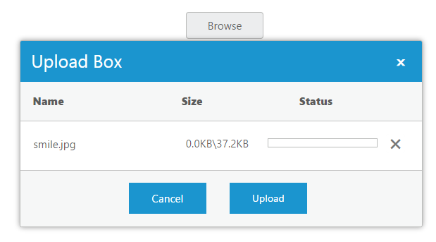
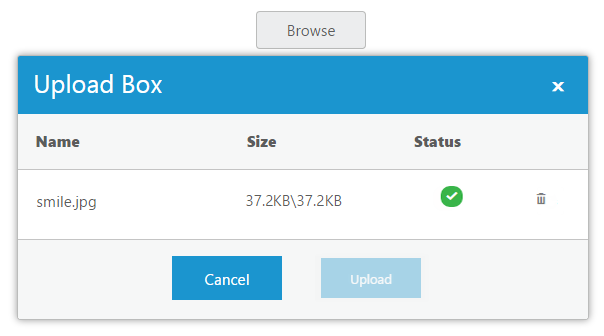

# Getting Started

This section explains briefly about how to create an **Uploadbox** in your application with **Angular 2.** **Essential JavaScript Uploadbox** widget provides support to upload files or photos within your web page. From the following guidelines, you can learn how to upload the files that are used in a Resume Upload scenario. This helps you to restrict some file extensions when you upload the resume in server by using **Uploadbox** control.

The following screenshot demonstrates the functionality of **Uploadbox** with the file extension.

 

In the above screenshot, you can upload a resume that allows **.txt** files. This helps you to avoid unsupported resume formats getting uploaded in a server.

N> To get upload the file, you should either run this sample in Visual Studio IDE or host in local IIS.

## Create Uploadbox widgets in Angular 2

**Essential JavaScript Uploadbox** widget basically renders built-in features like upload multiple files, and deletes the files from **Uploadbox**. You can know the status of uploading the file whether it is completed or failed and you can retry uploading the files.  You can easily create the **Uploadbox** widget by using the following steps.

Create an HTML page and add the scripts references in the order mentioned in the following code example.



     <!DOCTYPE html>
     <html>
     <head> 
     <link href="//cdn.syncfusion.com/14.3.0.49/js/web/flat-azure/ej.web.all.min.css" rel="stylesheet" />
     
     
     
     
     
     
     
     
     </head>
     <body>
     <ej-app>Loading...</ej-app>
     </body>
     </html>



 Add an element to render a **Uploadbox.**



       
Select a file to upload

           

           <ej-uploadbox id="UploadDefault" [saveUrl]="saveURL" [removeUrl]="removeURL"></ej-uploadbox>
       



Add the given styles to display the **Uploadbox** with margin alignments.



    



Create a new handler file (.ashx) and save it as **saveFiles.ashx** and then copy the following code into it.



SaveFiles.ashx

    public void ProcessRequest(HttpContext context)
    {
        string targetFolder = HttpContext.Current.Server.MapPath("uploadfiles");
        if (!Directory.Exists(targetFolder))
        {
            Directory.CreateDirectory(targetFolder);
        }
        HttpRequest request = context.Request;
        HttpFileCollection uploadedFiles = context.Request.Files;
        if (uploadedFiles != null && uploadedFiles.Count > 0)
        {
            for (int i = 0; i < uploadedFiles.Count; i++)
            {
                if (uploadedFiles[i].FileName != null && uploadedFiles[i].FileName != "")
                {
                    string fileName = uploadedFiles[i].FileName;
                    int indx = fileName.LastIndexOf("\\");
                    if (indx > -1)
                    {
                        fileName = fileName.Substring(indx + 1);
                    }
                    uploadedFiles[i].SaveAs(targetFolder + "\\" + fileName);
                }
            }
        }
    }



Create a new handler file (.ashx) and save it as **removeFiles.ashx** and then copy the following code into it.



removeFiles.ashx

    public void ProcessRequest(HttpContext context)
    {
        System.Collections.Specialized.NameValueCollection s = context.Request.Params;
        string fileName = s["fileNames"];
        string targetFolder = HttpContext.Current.Server.MapPath("uploadfiles");
        if (Directory.Exists(targetFolder))
        {
            string physicalPath = targetFolder + "\\" + fileName;
            if (System.IO.File.Exists(physicalPath))
            {
                System.IO.File.Delete(physicalPath);
            }
        }
    }



Add the following code example to assign saveUrl and removeUrl for Uploadbox



       import {Component} from '@angular/core';

        @Component({
                 selector: 'sd-home',
                  templateUrl: 'app/components/uploadbox/uploadbox.component.html' // path for uploadbox component
           })
             export class UploadBoxComponent {
	               saveURL:string;
                   removeURL:string;
                   constructor() {
	                this.saveURL = '../saveFiles.ashx';
                    this.removeURL = '../removeFiles.ashx'; 
	 
	                      }
               }



The following screenshot displays an **Uploadbox** control.

 

After you upload the files, the following screen shot is displayed. 

 

N> The above screenshot displays the Uploadbox control that shows the files are uploaded successfully.

## Set Restriction for File Extension

In a real-time scenario, some file extensions are restricted. You can allow files and restrict files by using the following two properties **extensionsAllow** and **extensionsDeny** enabled in **Uploadbox**. 

N> The SaveUrl and RemoveUrl are the same as above (see step 4)

Add input elements to create elements for file extension.

N> Add the following input elements and two button elements to give file extensions that should support uploading. 



     

     <table id="uploadTable">
        <tr>
            <td>
                Extensions:
            </td>

        </tr>
        <tr>
            <td>
                <input type="text" id="fileallow" class="ejinputtext" placeholder="Format" />
                <input ej-button type="submit" name="allow" value="Allow" (click)="onClick($event)" />
            </td>

        </tr>
        <tr>
            <td>
                <input type="text" id="filedeny" class="ejinputtext" placeholder="Format" />
                <input ej-button type="submit" name="deny" value="Deny" (click)="onclick($event)" />
            </td>
            <td>
                
Select a file to upload

                

                    <ej-uploadbox id="UploadDefault" [saveUrl]="saveURL" [removeUrl]="removeURL"></ej-uploadbox>
                

            </td>
        </tr>
      </table>
      

 

 Add the following code example for click event
 
 

      import {Component,ViewEncapsulation} from '@angular/core';
          @Component({
                 selector: 'ej-app',
                  templateUrl: 'app/app.component.html',
            
             })
            export class AppComponent {
                   saveURL:string;
                   removeURL:string;
                   constructor() {
		           this.saveURL = '../saveFiles.ashx';
                   this.removeURL = '../removeFiles.ashx'; 
	             }
         onClick(event) {
            var uploadobject = $("#uploadDefault").data("ejUploadbox");
            uploadobject.option('extensionsAllow', $("#fileallow").val());
           uploadobject.option('extensionsDeny', "");

           }

           onclick(event) {
                var uploadobject = $("#uploadDefault").data("ejUploadbox");
               uploadobject.option('extensionsAllow', "");
                uploadobject.option('extensionsDeny', $("#filedeny").val());

            }

         }



Add the given styles to display the **Uploadbox** with margin alignments.



     



N> You can restrict one or more files at a time by giving it as .html,.txt

The following screenshot displays an **Uploadbox** control with the file extension.

 

The above screenshot shows the **Uploadbox** that allows “**.txt”** file formats. You can give  number of  file formats in both allow and deny textbox elements.

## Upload Multiple Files

You can click the **Browse** button and select  files to upload multiple files in **Uploadbox** control. You can see the selected files in **Uploadbox** control and you can upload all the files.

The following screenshot displays an **Uploadbox** control with multiple files.

 

