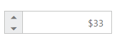

# RTL Support in Angular CurrencyTextBox

The **Textbox** provides **RTL** (Right-To-Left) support. The alignment of CurrencyTextBox can be changed from **Left-To-Right** into **Right-To-Left**.

## Enable RTL

The following steps explain the implementation of **enableRTL** in CurrencyTextBox.

In the **HTML** page set the corresponding **&lt;input&gt;** elements for rendering CurrencyTextBox controls.



<input id="currency" type="text" ej-currencytextbox [value]="value" [enableRTL]="true" />
	




import { Component } from '@angular/core';

@Component({
    selector: 'ej-app',
    templateUrl: 'src/currencytextbox/currencytextbox.component.html'
})
export class CurrencyTextboxComponent {
    public value: number;
    constructor() {
        this.value = 33;
    }
}



The output for CurrencyTextBox when **enableRTL** is **“true”** is as follows. 

