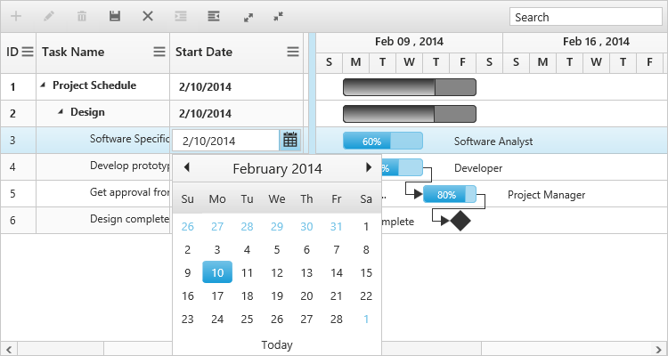

# Editing

The Gantt control provides built-in support to add, insert and update the tasks. The following are the types of editing available in Gantt,

* Cell Editing
* Normal Editing
* Taskbar Editing
* Predecessor Editing

## Cell Editing

Update the task details through grid cell editing by setting editMode as `cellEditing`.

The following code example shows you how to enable `cellEditing` in Gantt control.



<ej-gantt
    //...
    [editSettings]= "editSettings">
</ej-gantt>





import {Component} from '@angular/core';

@Component({
    selector: 'ej-app',
    templateUrl: 'app/app.component.html',
})
export class AppComponent {
    public editSettings: any;
    constructor() {
        this.editSettings = {
            allowEditing: true,
            editMode: "cellEditing"
        }
    }
}



The output of Gantt with cellEditing is as follows.

## Normal Editing

Update the task details through edit dialog by setting `editMode` as `normal`.

The following code example shows you how to enable normal editing in Gantt control.



<ej-gantt
    //...
    [editSettings]= "editSettings">
</ej-gantt>





import {Component} from '@angular/core';

@Component({
    selector: 'ej-app',
    templateUrl: 'app/app.component.html',
})
export class AppComponent {
    public editSettings: any;
    constructor() {
        this.editSettings = {
            allowEditing: true,
            editMode: "normal"
        }
    }
}



The following screenshot shows the output of `normal` editing.

## Taskbar Editing

Update the task details by interactions such as resizing and dragging the taskbar. The following code example shows you how to enable taskbar resizing in Gantt control.



<ej-gantt
    //...
    [allowGanttChartEditing]= "true">
</ej-gantt>



You can also enable or disable the progressbar resizing by setting 'enableProgressbarResizing'. The following code example shows you to disable this property.



<ej-gantt
    //...
    [enableProgressBarResizing]= "true">
</ej-gantt>



## Predecessor Editing

Update the predecessor details of a task using mouse interactions. The following code example shows how to enable predecessor editing.



<ej-gantt
    //...
    [dataSource]= "data"
    [allowGanttChartEditing]="true"
    predecessorMapping= "predecessor">
</ej-gantt>



The following screen shot shows the predecessor editing in Gantt control.

[Click](http://js.syncfusion.com/demos/web/#!/bootstrap/gantt/editing) here to view the online demo sample for editing in Gantt.