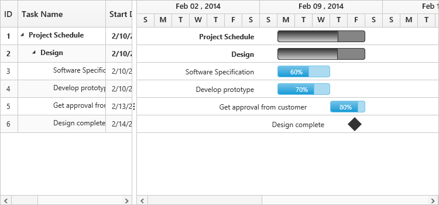
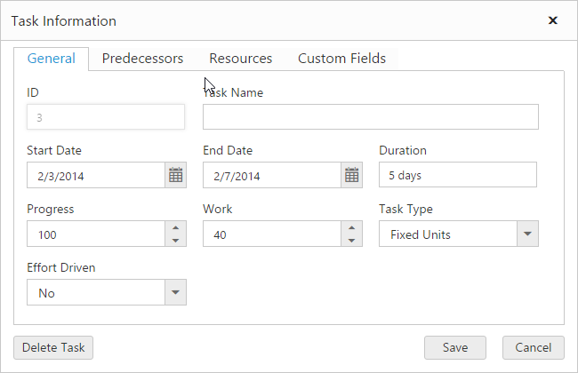
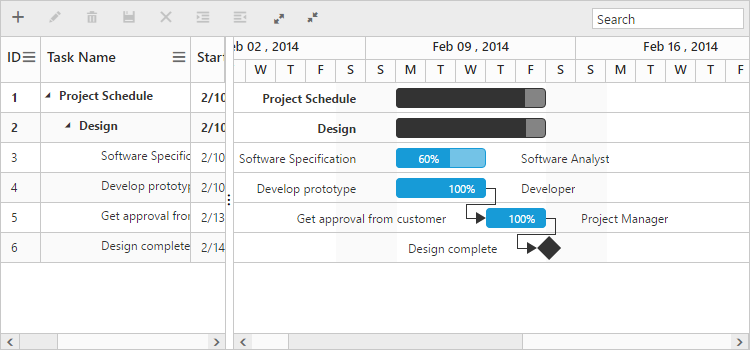

# Create your first Gantt in Angular 2

## Getting started with SystemJS

To quick start with Syncfusion JavaScript Angular 2 components run the below commands to clone the repository for [SystemJS starter](https://github.com/syncfusion/angular2-seeds/tree/systemjs) and installing required dependency packages.


 > git clone https://github.com/syncfusion/angular2-seeds/ -b systemjs

 > cd angular2-seeds

 > npm install

 
The below steps describes to add component with above cloned seed application.

## Syncfusion JavaScript components source configuration and sample creation

* Copy required Syncfusion Angular 2 source component(s) from the below build location and add it in `src/ej` folder (For ex., consider the `gantt` component).


(Installed Location)\Syncfusion\Essential Studio\{{ site.releaseversion }}\JavaScript\assets-src\angular2\ 


N> `core.ts` file is mandatory for all Syncfusion JavaScript Angular 2 components. The repository having the source file from Essential Studio for JavaScript v{{ site.releaseversion }}.

* Create `gantt` folder inside `src` folder.

* Create `gantt.component.html` view file inside `src/gantt` folder and render ejGantt Angular 2 component using the below code example. 


<ej-gantt id="GanttControl" [dataSource]="ganttData" taskIdMapping="taskID" taskNameMapping="taskName"
            startDateMapping="startDate" endDateMapping="endDate" progressMapping="progress" durationMapping="duration" predecessorMapping="predecessor"
            childMapping="subtasks" [treeColumnIndex]=treeColumnIndex  scheduleStartDate="02/01/2014" scheduleEndDate="04/09/2014"
            sizeSettings.height="450px" sizeSettings.width="100%">
</ej-gantt>


* Create `gantt.component.ts` model file inside the folder `src/gantt` and create sample component using the below code example.



import { Component } from '@angular/core';

@Component({
  selector: 'ej-app',
  templateUrl: 'app/components/gantt/gantt.component.html',
  styleUrls: ['app/components/gantt/gantt.component.css'], 
})

export class DefaultComponent {

    this.ganttData =  [{
         taskID: 1,
         taskName: "Planning",
         startDate: "02/03/2014",
         endDate: "02/07/2014",
         progress: 100,
         duration: 5,
         subtasks: [
             { taskID: 2, taskName: "Plan timeline", startDate: "02/03/2014", endDate: "02/07/2014", duration: 5, progress: 100 },
             { taskID: 3, taskName: "Plan budget", startDate: "02/03/2014", endDate: "02/07/2014", duration: 5 },
             { taskID: 4, taskName: "Allocate resources", startDate: "02/03/2014", endDate: "02/07/2014", duration: 5, progress: 100 },
             { taskID: 5, taskName: "Planning complete", startDate: "02/07/2014", endDate: "02/07/2014", duration: 0, progress: 0 }
         ]
     }]  
  public treeColumnIndex = 1;
}



## Configure the routes for the Router

Before adding router configuration for above created ejGantt component, we recommend you to go through the [Angular 2 Routing](https://angular.io/docs/ts/latest/guide/router.html) configuration to get the deeper knowledge about Angular 2 routing. 

* Now, we are going to configure the route navigation link for created Gantt sample in `src/app.component.html` file.



	<ul class="nav navbar-nav">
		. . . .
		<li><a data-toggle="collapse" data-target="#skeleton-navigation-navbar-collapse.in" href="#gantt" [routerLink]="['/gantt']">Gantt </a></li>
	</ul>

<main>
	<router-outlet></router-outlet>
</main>


* Import the ejGantt sample component and define the route in `src/app.routes.ts` file.


import { Routes } from '@angular/router';
. . . . 
import { GanttComponent } from './gantt/gantt.component';

export const rootRouterConfig: Routes = [
    { path: '', redirectTo: 'home', pathMatch: 'full' },
    . . . . 
    { path: 'gantt', component: GanttComponent }
];


* Import and declare the Syncfusion source component and ejGantt sample component into `app.module.ts` like the below code snippet.



import { NgModule, enableProdMode, ErrorHandler } from '@angular/core';
. . . . . 
import { EJ_GANTT_COMPONENTS } from './ej/gantt.component';
import { GanttComponent } from './gantt/gantt.component';

import { rootRouterConfig } from './app.routes';
. . . . 
@NgModule({
  imports: [BrowserModule, FormsModule, HttpModule, RouterModule.forRoot(rootRouterConfig, { useHash: true })],
  declarations: [. . . . , EJ_GANTT_COMPONENTS,GanttComponent],
  bootstrap: [AppComponent]
})
export class AppModule { }


A Gantt Control is created as shown in the following screen shot.

## Enable Toolbar

Gantt control contains toolbar options to edit, search, expand or collapse all records, indent, outdent, delete, and add a task. You can enable toolbar using the [`toolbarSettings`](http://help.syncfusion.com/js/api/ejgantt#members:toolbarsettings "toolbarSettings") property.


<ej-gantt id="GanttControl" 
//...
            [toolbarSettings]="toolbarsettings" [editSettings]="editsettings"
           >
</ej-gantt>




import { Component } from '@angular/core';

@Component({
  selector: 'ej-app',
  templateUrl: 'app/components/gantt/gantt.component.html',
  styleUrls: ['app/components/gantt/gantt.component.css'], 
})

export class DefaultComponent {
  constructor(public ganttDataService: GanttDataService) {
    this.toolbarsettings = {
            showToolbar: true,
            toolbarItems: [
                ej.Gantt.ToolbarItems.Add,
                ej.Gantt.ToolbarItems.Edit,
                ej.Gantt.ToolbarItems.Delete,
                ej.Gantt.ToolbarItems.Update,
                ej.Gantt.ToolbarItems.Cancel,
                ej.Gantt.ToolbarItems.Indent,
                ej.Gantt.ToolbarItems.Outdent,
                ej.Gantt.ToolbarItems.ExpandAll,
                ej.Gantt.ToolbarItems.CollapseAll
            ]
        };
        this.editsettings = {
            allowEditing: true,
            allowAdding: true,
            allowDeleting: true,
            allowIndent: true,
            editMode: 'cellEditing'
        };
  }
}



The following screen shot displays a Tool bar in Gantt chart control:

N>  Add, edit, delete, indent and outdent options are enabled when enabling the allowEditing, allowAdding, allowDelete, allowIndent and allowOutdent properties in the edit Options.

## Enable Sorting

The Gantt control has sorting functionality to arrange the tasks in ascending or descending order based on a particular column.

### Multicolumn Sorting

Enable the multicolumn sorting in Gantt by setting [`allowMultiSorting`](http://help.syncfusion.com/js/api/ejgantt#members:allowmultisorting "allowMultiSorting") as `true`. You can sort multiple columns in Gantt, by selecting the desired column header while holding the `CTRL` key.


<ej-gantt id="GanttControl" 
//...
           [allowMultiSorting]="true"
           >
</ej-gantt>


## Enable Editing

You can enable editing using [`editSettings`](http://help.syncfusion.com/js/api/ejgantt#members:editsettings "editSettings") and [`allowGanttChartEditing`](http://help.syncfusion.com/js/api/ejgantt#members:allowganttchartediting "allowGanttChartEditing") options.

### Cell Editing

Modify the task details through the grid cell editing by setting the [`editMode`](http://help.syncfusion.com/js/api/ejgantt#members:editsettings-editmode "editSettings.editMode") as [`cellEditing`](http://help.syncfusion.com/js/api/ejgantt#members:editsettings-editmode "cellEditing").

### Normal Editing

Modify the task details through the edit dialog by setting the [`editMode`](http://help.syncfusion.com/js/api/ejgantt#members:editsettings-editmode "editSettings.editMode") as [`normal`](http://help.syncfusion.com/js/api/ejgantt#members:editsettings-editmode "normal").

### Taskbar Editing

Modify the task details through user interaction such as resizing and dragging the taskbar.

### Predecessor Editing

Modify the predecessor details of a task using mouse interactions by setting [`allowGanttChartEditing`](http://help.syncfusion.com/js/api/ejgantt#members:allowganttchartediting "allowGanttChartEditing") as `true` and setting the value for `predecessorMapping` property.


<ej-gantt id="GanttControl" 
//...
           [allowGanttChartEditing]="true"
           predecessorMapping="predecessor"
           [editSettings]="editsettings"
           >
</ej-gantt>




import { Component } from '@angular/core';

@Component({
  selector: 'ej-app',
  templateUrl: 'app/components/gantt/gantt.component.html',
  styleUrls: ['app/components/gantt/gantt.component.css'], 
})

export class DefaultComponent {
  constructor(public ganttDataService: GanttDataService) {
        this.editsettings = {
            allowEditing: true,
            allowAdding: true,
            allowDeleting: true,
            allowIndent: true,
            editMode: 'cellEditing'
        };
  }
}


The following screen shot displays a Gantt chart control with Enable Editing options.

N>  Both cellEditing and normal editing operations are performed through double-click or single click action that can be defined by editSettings.beginEditAction property.

## Enable Context Menu

You can enable the context menu in Gantt, by setting the [`enableContextMenu`](http://help.syncfusion.com/js/api/ejgantt#members:enablecontextmenu "enableContextMenu") as `true`.


<ej-gantt id="GanttControl" 
//...
           [enableContextMenu]="true"
           >
</ej-gantt>


The following screen shot displays Gantt chart in which Context menu option is enabled:

## Enable Column Menu

You can enable the column menu in Gantt, by setting the [`showColumnChooser`](http://help.syncfusion.com/js/api/ejgantt#members:showcolumnchooser "showColumnChooser") as `true`.


<ej-gantt id="GanttControl" 
//...
           [showColumnChooser]="true"
           >
</ej-gantt>


The following screen shot displays Gantt chart in which column chooser option is enabled:

## Provide tasks relationship

In Gantt, you have the predecessor support to show the relationship between two different tasks.

* **Start to Start (SS)** - You cannot start a task until the other task also starts.
* **Start to Finish (SF)** - You cannot finish a task until the other task finishes.
* **Finish to Start (FS)** - You cannot start a task until the other task completes.
* **Finish to Finish (FF)** - You cannot finish a task until the other task completes.

You can show the relationship in tasks, by using the [`predecessorMapping`](http://help.syncfusion.com/js/api/ejgantt#members:predecessormapping "predecessorsMapping")

, as shown in the following code example.


<ej-gantt id="GanttControl" 
//...
           predecessorMapping="predecessor"
           >
</ej-gantt>


The following screenshot displays the relationship between tasks.

## Provide Resources

In Gantt control, you can display and assign the resource for each task. Create a collection of `JSON` object, which contains id and name of the resource and assign it to [`resources`](http://help.syncfusion.com/js/api/ejgantt#members:resources "resources") property. Then, specify the field name for id and name of the resource in the resource collection to [`resourceIdMapping`](http://help.syncfusion.com/js/api/ejgantt#members:resourceidmapping "resourceIdMapping") and [`resourceNameMapping`](http://help.syncfusion.com/js/api/ejgantt#members:resourcenamemapping "resourceNameMapping") options. The name of the field, which contains the actual resources assigned for a particular task in the `dataSource` is specified using [`resourceInfoMapping`](http://help.syncfusion.com/js/api/ejgantt#members:resourceinfomapping "resourceInfoMapping").

1.Create the resource collection to be displayed in ejGantt



import { Component } from '@angular/core';

@Component({
  selector: 'ej-app',
  templateUrl: 'app/components/gantt/gantt.component.html',
  styleUrls: ['app/components/gantt/gantt.component.css'], 
})

export class DefaultComponent {
  constructor(public ganttDataService: GanttDataService) {
        this.projectResources =[{
        resourceId: 1,
        resourceName: "Project Manager"
    },{
        resourceId: 2,
        resourceName: "Software Analyst"
    },{
        resourceId: 3,
        resourceName: "Developer"
    },{
        resourceId: 4,
        resourceName: "Testing Engineer"
    }];
  }
}


2.Initialize the Gantt with resources created in last step. 


<ej-gantt id="GanttControl" 
//...
            resourceInfoMapping="resourceId"
            resourceNameMapping="resourceName"
            resourceIdMapping="resourceId"
            [resources]="projectResources"
           >
</ej-gantt>


The following screenshot displays resource allocation for tasks in Gantt chart.

By following these steps, you have learned how to provide data source to Gantt chart, how to configure Gantt to set task relationships, assign resources for each task, and add toolbar with necessary buttons.

## Highlight Weekend

In Gantt, you can on or off weekends highlighting by setting the [`highlightWeekends`](https://help.syncfusion.com/api/js/ejgantt#members:highlightweekends "highlightWeekEnds")

 as `true` or `false`.


<ej-gantt id="GanttControl" 
//...
           highlightWeekends="true"
           >
</ej-gantt>


The following screen shot displays Gantt chart in which highlight weekends is disabled:

## Running the application

* To run the application, execute below command.


npm start


* Browse to [http://localhost:3000](http://localhost:3000) to see the application. And navigate to Gantt tab. The component is rendered as like the below screenshot. You can make changes in the code found under src folder and the browser should auto-refresh itself while you save files. 
