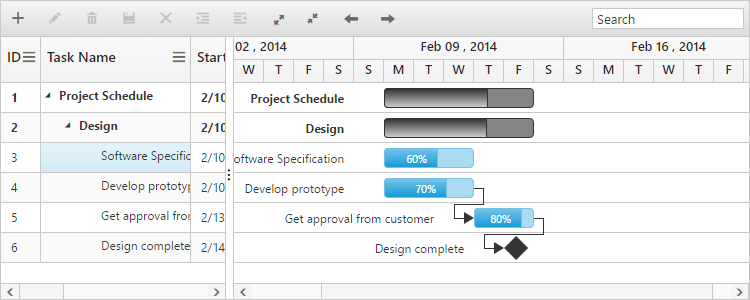
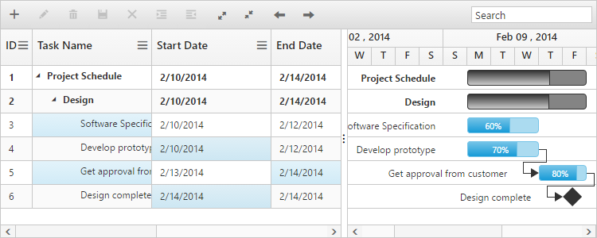
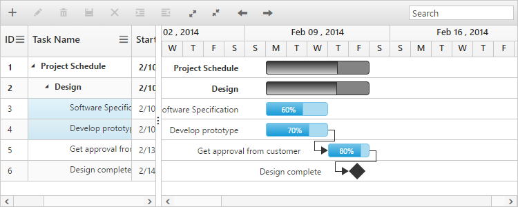

# Selection

## Row selection

You can enable or disable the row selection in Gantt, by using [allowSelection](/api/js/ejgantt#members:allowselection) property. And you can able to get the selected row object using selectedItem property from the Gantt model. The following code example shows how to disable the row selection in Gantt.



<ej-gantt id="GanttControl" [allowSelection]="false"
    //...>
</ej-gantt>



### Selecting a row on initial load

You can select a row on load time by setting the index of the row to [selectedRowIndex](/api/js/ejgantt#members:selectedrowindex) property. Find the following code example for details.



<ej-gantt id="GanttControl" [selectedRowIndex]="selectedRowIndex"
    //...>
</ej-gantt>





import { Component } from '@angular/core';

@Component({
  selector: 'ej-app',
    templateUrl: 'app/app.component.html'
})
export class AppComponent {
  public selectedRowIndex:any;
  constructor() {
   //...
   this.selectedRowIndex=3;
  }
}



### Selecting a row programmatically 

You can also select a row programmatically by setting index of the row value to [selectedRowIndex](/api/js/ejgantt#members:selectedrowindex) property. The following code shows to select a row programmatically with a custom button click action,



<button id="selectRow" (click)="selectRow($event)">SelectRow</button>

<ej-gantt id="GanttControl"
    //...>
</ej-gantt>





import { Component } from '@angular/core';

@Component({
  selector: 'ej-app',
    templateUrl: 'app/app.component.html',
})
export class AppComponent {
  constructor() {
   //...
  }
   public selectRow(event) {
         $("#GanttControl ").ejGantt("option", "selectedRowIndex", 4);
    }
}



## Cell selection

You can select a cell in Gantt by setting [selectionMode](/api/js/ejgantt#members:selectionmode) property as ‘cell’. And you can able to get the selected cell information using selectedCellIndexes property from the Gantt object. selectedCellIndexes is an object collection, which has the cell index and row index information of the selected cells.

Find the code example below to enable the cell selection in Gantt. 



<ej-gantt id="GanttControl" selectionMode="cell"
    //...>
</ej-gantt>



The following screen shots shows you cell selection.

### Selecting multiple cells

You can also select multiple cells by setting [selectionType](/api/js/ejgantt#members:selectiontype) property as ‘multiple’ while [selectionMode](/api/js/ejgantt#members:selectionmode) property is set to “cell”. Multiple cells can be selected by holding the ctrl key and to click on the cells. The following code example shows you to select multiple cells.



<ej-gantt id="GanttControl" selectionMode="cell" selectionType= "multiple"
    //...>
</ej-gantt>



### Select cells programmatically 

You can select the cells programmatically using [selectCells](/api/js/ejgantt#methods:selectcells) public method. Find the code example below for details.



<button id="selectcells" (click)="selectcells($event)">Selectcells</button>

<ej-gantt id="GanttControl"
    //...>
</ej-gantt>





import {Component} from '@angular/core';

@Component({
    selector: 'ej-app',
    templateUrl: 'app/app.component.html',
})
export class AppComponent {
    constructor() {
        //...
    }
    public selectcells(event) {
        //create Gantt object
        var ganttObj = $("#GanttControl").data("ejGantt");
        cellIndex = [{
            rowIndex: 2,
            cellIndex: 1
        }, {
            rowIndex: 3,
            cellIndex: 1
        }];
        ganttObj.selectCells(cellIndex);
    }
}



