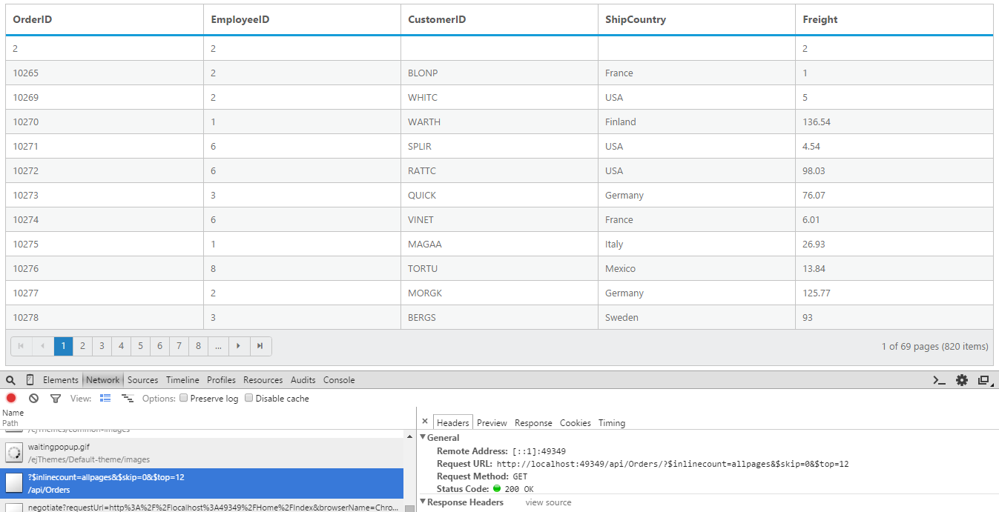
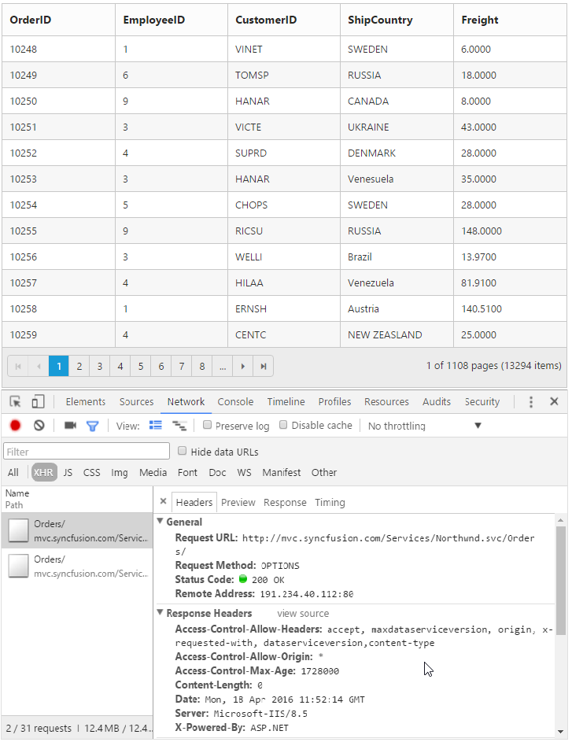
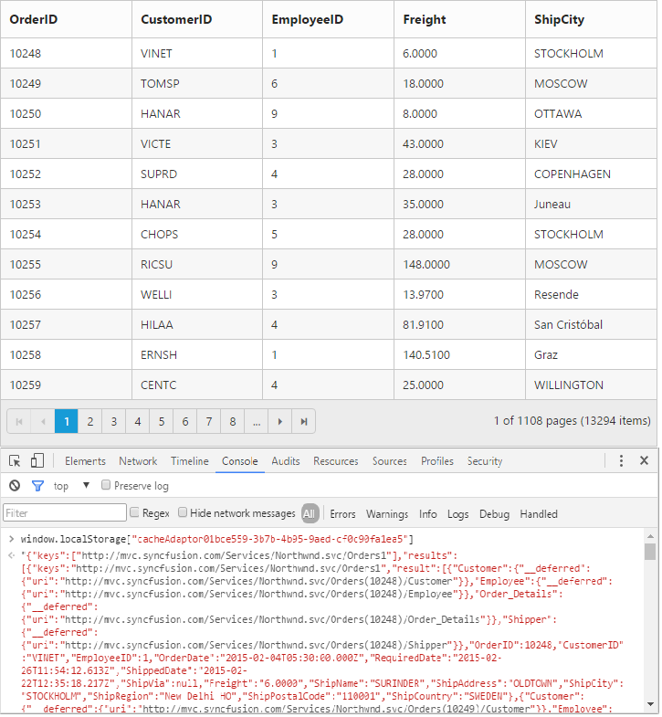

---
layout: post
title: DataBinding with Grid widget for Syncfusion Essential Angular-2
description: How to bind in-memory JSON and remote web services in Grid
platform: Angular
control: Grid
documentation: ug
api: /api/Angular/grid
--- 
# Data binding

The Grid control uses `ej.DataManager` which supports both RESTful JSON data services binding and local JSON array binding.  The [`dataSource`](https://help.syncfusion.com/api/angular/ejgrid#members:datasource "dataSource") property can be assigned either with the instance of `ej.DataManger` or JSON data array collection. It supports different kinds of data binding methods such as

1. Local data
2. Remote data

## Local Data

To bind local data to the Grid, you can assign a JSON array to the [`dataSource`](https://help.syncfusion.com/api/angular/ejgrid#members:datasource "dataSource") property.

The following code example describes the above behavior.



<ej-grid id="Grid" [dataSource]="gridData" [allowPaging]="true">
    <e-columns>
        <e-column field="OrderID" headerText="OrderID"></e-column>
        <e-column field="EmployeeID" headerText="EmployeeID"></e-column>
        <e-column field="ShipCity" headerText="ShipCity"></e-column>
        <e-column field="ShipCountry" headerText="ShipCountry"></e-column>
        <e-column field="Freight" headerText="Freight"></e-column>
    </e-columns>
</ej-grid>




  
    import {Component, ViewEncapsulation} from '@angular/core';
     @Component({
      selector: 'ej-app',
      templateUrl: 'app/app.component.html',  //give the path file for Grid control html file.
     })
     export class AppComponent {
        public gridData;
        constructor()
        {
           //The datasource "window.gridData" is referred from 'http://js.syncfusion.com/demos/web/scripts/jsondata.min.js'
           this.gridData = window.gridData;
		}
     }
   


The following output is displayed as a result of the above code example.

N> 1. There is no in-built support to bind the XML data to the grid. But you can achieve this requirement with the help of [`custom adaptor`]concept. 
N> 2. Refer this [Knowledge Base link](http://www.syncfusion.com/kb/3377/how-to-process-xml-data-from-server-using-datamanager-and-bound-to-grid#) for bounding XML data to grid using custom adaptor. 

## Remote Data

To bind remote data to Grid Control, you can assign a service data as an instance of `ej.DataManager` to the `dataSource` property.

### OData

OData is a standardized protocol for creating and consuming data. You can provide the [OData service](http://www.odata.org/#) URL directly to the `ej.DataManager` class and then you can assign it to Grid [`dataSource`](https://help.syncfusion.com/api/angular/ejgrid#members:datasource "dataSource").

The following code example describes the above behavior.



<ej-grid id="Grid" [dataSource]="gridData" [allowPaging]="true">
    <e-columns>
        <e-column field="OrderID"  headerText="OrderID"></e-column>
        <e-column field="EmployeeID" headerText="EmployeeID"></e-column>
        <e-column field="CustomerID" headerText="CustomerID"></e-column>
        <e-column field="ShipCountry" headerText="ShipCountry"></e-column>
        <e-column field="Freight" headerText="Freight"></e-column>
    </e-columns>
</ej-grid>





    import {Component, ViewEncapsulation} from '@angular/core';
    import {NorthwindService} from './services/northwind.service';
    @Component({
      selector: 'ej-app',
      templateUrl: 'app/app.component.html',  //give the path file for Grid control html file.
      providers:[NorthwindService]
    })
    export class AppComponent {
        public gridData;
        public dataManager;
    	constructor()
        {
             this.dataManager = ej.DataManager({
                    url: "http://mvc.syncfusion.com/Services/Northwnd.svc/Orders/", 
                    crossDomain:true
                });
             this.gridData = this.dataManager;
         }
    }
	


	
The following output is displayed as a result of the above code example.

N> By default, if no adaptor is specified for ej.DataMananger and only the url link is mentioned it will consider as ODataService. 

#### OData Version 4

For OData Version 4 support, ej.ODataV4Adaptor should be used. By using `url` property of `ej.DataManager` you can bind OData Version 4 Service link and specify  `adaptor` as `ej.ODataV4Adaptor`.

I> You can provide adaptor value either as `string` value ("ODataAdaptor") or by creating a new instance (new `ej.ODataV4Adaptor`).

The following code example describes the above behavior.



<ej-grid id="Grid" [dataSource]="gridData" [allowPaging]="true">
</ej-grid>





    import {Component, ViewEncapsulation} from '@angular/core';
    import {NorthwindService} from './services/northwind.service';
    @Component({
      selector: 'ej-app',
      templateUrl: 'app/app.component.html',  //give the path file for Grid control html file.
      providers:[NorthwindService]
    })
    export class AppComponent {
        public gridData;
        public dataManager;
    	constructor()
        {
             this.dataManager = ej.DataManager({
                   url:["http://services.odata.org/V4/Northwind/Northwind.svc/Regions/"](http://services.odata.org/V4/Northwind/Northwind.svc/Regions/#),
			       adaptor: new ej.ODataV4Adaptor()
                });
             this.gridData = this.dataManager;
         }
    }
	


For further details about OData service please refer to [this link](http://www.odata.org/#). 

### WebAPI

Using `ej.WebApiAdaptor`, you can bind WebApi service data to Grid. The data from WebApi service must be returned as object that has property `Items` with its value as datasource and another property `Count` with its value as dataSource's total records count.

The following code example describes the above behavior.



<ej-grid id="Grid" [dataSource]="gridData" [allowPaging]="true">
    <e-columns>
        <e-column field="OrderID"  headerText="OrderID"></e-column>
        <e-column field="EmployeeID" headerText="EmployeeID"></e-column>
        <e-column field="CustomerID" headerText="CustomerID"></e-column>
        <e-column field="ShipCountry" headerText="ShipCountry"></e-column>
        <e-column field="Freight" headerText="Freight"></e-column>
    </e-columns> 
</ej-grid>





    import {Component, ViewEncapsulation} from '@angular/core';
    import {NorthwindService} from './services/northwind.service';
    @Component({
      selector: 'ej-app',
      templateUrl: 'app/app.component.html',  //give the path file for Grid control html file.
      providers:[NorthwindService]
    })
    export class AppComponent {
        public gridData;
        public dataManager;
    	constructor()
        {
             this.dataManager = ej.DataManager({
                   url:"/api/Orders",
			       adaptor: new ej.WebApiAdaptor()
              });
             this.gridData = this.dataManager;
         }
    }
	



using EJGrid.Models;
using System;
using System.Collections.Generic;
using System.Linq;
using System.Linq.Expressions;
using System.Net;
using System.Net.Http;
using System.Web;
using System.Web.Http;

namespace EJGrid.Controllers
{

	public class OrdersController: ApiController
	{

		// GET: api/Orders
		NORTHWNDEntities db = new NORTHWNDEntities();

		public object Get()
		{
			var queryString = HttpContext.Current.Request.QueryString;
			int skip = Convert.ToInt32(queryString["$skip"]);
			int take = Convert.ToInt32(queryString["$top"]);
			var data = db.Orders.Skip(skip).Take(take).ToList();
			return new {
				Items = data.Skip(skip).Take(take), Count = data.Count()
			};
		}
	}
}


The following output is displayed as a result of the above code example.

### Load At Once

On remote data binding, by default all the Grid actions will be processed on server-side such as paging, sorting, editing, grouping and filtering etc. To avoid post back to server on every action, you can set the grid to load all the data on initialization time and make the actions client-side. To enable this, you can use `offline` property of the `ej.DataManager`.

The following code example describes the above behavior.



<ej-grid id="Grid" [dataSource]="gridData" [allowPaging]="true">
    <e-columns>
        <e-column field="OrderID"  headerText="OrderID"></e-column>
        <e-column field="EmployeeID" headerText="EmployeeID"></e-column>
        <e-column field="CustomerID" headerText="CustomerID"></e-column>
        <e-column field="ShipCountry" headerText="ShipCountry"></e-column>
        <e-column field="Freight" headerText="Freight"></e-column>
    </e-columns> 
</ej-grid>





    import {Component, ViewEncapsulation} from '@angular/core';
    import {NorthwindService} from './services/northwind.service';
    @Component({
      selector: 'ej-app',
      templateUrl: 'app/app.component.html',  //give the path file for Grid control html file.
      providers:[NorthwindService]
    })
    export class AppComponent {
        public gridData;
        public dataManager;
    	constructor()
         {
             this.dataManager = ej.DataManager({
                  url: "http://mvc.syncfusion.com/Services/Northwnd.svc/Orders/",
		          adaptor: new ej.ODataAdaptor(),
		          offline: true
          });
             this.gridData = this.dataManager;
         }
    }
	


Please refer to this for further reference on `offline` property

The following output is displayed as a result of the above code example.

### Data Caching

Date caching will help you prevent the request to server for already visited pages in Grid using the `enableCaching` property of `ej.DataManager`. Also using `cachingPageSize` and `timeTillExpiration` properties of `ej.DataManager`, you can control the number of pages to be cached and duration it should be cached respectively.

N> The cached data will be stored in browser's HTML5 `localStorage`. 

The following code example describes the above behavior.



<ej-grid id="Grid" [dataSource]="gridData" [allowPaging]="true">
    <e-columns>
        <e-column field="OrderID"  headerText="OrderID"></e-column>
        <e-column field="CustomerID" headerText="CustomerID"></e-column>
        <e-column field="EmployeeID" headerText="EmployeeID"></e-column>
        <e-column field="Freight" headerText="Freight"></e-column>
        <e-column field="ShipCity" headerText="ShipCity"></e-column>
    </e-columns> 
</ej-grid>





    import {Component, ViewEncapsulation} from '@angular/core';
    import {NorthwindService} from './services/northwind.service';
    @Component({
      selector: 'ej-app',
      templateUrl: 'app/app.component.html',  //give the path file for Grid control html file.
      providers:[NorthwindService]
    })
    export class AppComponent {
        public gridData;
        public dataManager;
    	constructor()
         {
             this.dataManager = ej.DataManager({
                 url: "http://mvc.syncfusion.com/Services/Northwnd.svc/Orders/",
		         enableCaching: true,
		         cachingPageSize: 10,
		         timeTillExpiration: 120000
          });
             this.gridData = this.dataManager;
         }
    }
	


The following output is displayed as a result of the above code example.

### Custom request parameters and HTTP Header

#### Adding request parameters

You can use the `addParams` method of `ej.Query` class, to add custom parameter to the data request. The Grid has [`query`](https://help.syncfusion.com/api/angular/ejgrid#members:query "query") property, which accepts instance of `ej.Query`.

The following code example describes the above behavior.



<ej-grid id="Grid" [dataSource]="gridData" [allowPaging]="true" [query]="queryOrder">
    <e-columns>
        <e-column field="OrderID"  headerText="OrderID"></e-column>
        <e-column field="EmployeeID" headerText="EmployeeID"></e-column>
        <e-column field="ShipCity" headerText="ShipCity"></e-column>
        <e-column field="ShipCountry" headerText="ShipCountry"></e-column>
        <e-column field="Freight" headerText="Freight"></e-column>
    </e-columns> 
</ej-grid>





    import {Component, ViewEncapsulation} from '@angular/core';
    import {NorthwindService} from './services/northwind.service';
    @Component({
      selector: 'ej-app',
      templateUrl: 'app/app.component.html',  //give the path file for Grid control html file.
      providers:[NorthwindService]
    })
    export class AppComponent {
        public gridData;
        public dataManager;
        public queryOrder;
    	constructor()
         {
             this.dataManager = ej.DataManager({
                 url: "http://mvc.syncfusion.com/Services/Northwnd.svc/Orders/",
		         enableCaching: true,
		         cachingPageSize: 10,
		         timeTillExpiration: 120000
          });
             this.gridData = this.dataManager;
             this.queryOrder = new ej.Query().addParams("Syncfusion", true),
         }
    }
	


The custom parameter will be passed along with the data request of the grid as follows.

#### Handling HTTP Errors

During server interaction from the Grid, there may occur some server-side exceptions and you can acquire those error messages or exception details in client-side using the [`actionFailure`](https://help.syncfusion.com/api/angular/ejgrid#events:actionfailure "actionFailure") event of Grid Control.

The argument passed to the [`actionFailure`](https://help.syncfusion.com/api/angular/ejgrid#events:actionfailure "actionFailure") Grid event contains the Error details returned from server. Please refer to the following table for some error details that would be acquired in client-side event arguments.

 <table>
        <tr>
            <th>
                Parameter
            </th>
            <th>
                Description
            </th>
        </tr>
        <tr>
            <td>
                argument.error.status
            </td>
            <td>
                It returns the response error code.
            </td>
        </tr>
        <tr>
            <td>
                argument.error.statusText
            </td>
            <td>
                It returns the error message.
            </td>
        </tr>
    </table>

The following code example describes the above behavior.



<ej-grid id="Grid" [dataSource]="gridData" [allowPaging]="true" (actionFailure)="actionFailure($event)">
    <e-columns>
        <e-column field="OrderID"  headerText="OrderID"></e-column>
        <e-column field="CustomerID" headerText="CustomerID"></e-column>
        <e-column field="EmployeeID" headerText="EmployeeID"></e-column>
        <e-column field="Freight" headerText="Freight"></e-column>
        <e-column field="ShipCity" headerText="ShipCity"></e-column>
    </e-columns> 
</ej-grid>





    import {Component, ViewEncapsulation} from '@angular/core';
    import {NorthwindService} from './services/northwind.service';
    @Component({
      selector: 'ej-app',
      templateUrl: 'app/app.component.html',  //give the path file for Grid control html file.
      providers:[NorthwindService]
    })
    export class AppComponent {
        public gridData;
        public dataManager;
         public actionFailure(e){ 
	        alert(e.error.status + " : " + e.error.statusText);
	     }
    	constructor()
         {
             this.dataManager = ej.DataManager({
		           url: "http://mvc.syncfusion.com/Services/Northwnd.svc/Orders/",
		           adaptor: "ODataAdaptor"
	          });
             this.gridData = this.dataManager;
         }
    }
	


The following output is displayed as a result of the above code example.

## HTML Table 

A HTML Table element can also be used as the datasource of Grid. To use HTML Table as datasource, the table element should be passed to [`dataSource`](https://help.syncfusion.com/api/angular/ejgrid#members:datasource "dataSource") property of Grid as an instance of the `ej.DataManager`.

The following code example describes the above behavior.


<table id="Table1">
   <thead>
      <tr>
         <th>Laptop</th>
         <th>Model</th>
         <th>Price</th>
         <th>OS</th>
         <th>RAM</th>
         <th>ScreenSize</th>
      </tr>
   </thead>
   <tbody>
      <tr>
         <td>Dell Vostro</td>
         <td>2520</td>
         <td>39990</td>
         <td>Windows 8</td>
         <td>4GB</td>
         <td>15.6</td>
      </tr>
      <tr>
         <td>HP Pavilion Sleekbook</td>
         <td>14-B104AU</td>
         <td>22800</td>
         <td>Windows 8</td>
         <td>2GB</td>
         <td>14</td>
      </tr>
      <tr>
         <td>Sony Vaio</td>
         <td>E14A15</td>
         <td>42500</td>
         <td>Windows 7 Home Premium</td>
         <td>4GB DDR3 RAM</td>
         <td>14</td>
      </tr>
      <tr>
         <td>Lenovo</td>
         <td>Yoga 13</td>
         <td>57000</td>
         <td>Windows 8 RT</td>
         <td>2GB DDR3 RAM</td>
         <td>11.6</td>
      </tr>
      <tr>
         <td>Toshiba</td>
         <td>L850-Y3110</td>
         <td>57700</td>
         <td>Windows 8 SL</td>
         <td>8GB DDR3 RAM</td>
         <td>15.6</td>
      </tr>
   </tbody>
</table>





<ej-grid id="Grid" [dataSource]="gridData">
    <e-columns>
        <e-column field="Laptop"  headerText="Laptop""></e-column>
        <e-column field="Model"  headerText="Model"></e-column>
        <e-column field="Price" headerText="Price"></e-column>
        <e-column field="RAM" headerText="RAM"></e-column>
        <e-column field="ScreenSize" headerText="ScreenSize"></e-column>
    </e-columns> 
</ej-grid>





    import {Component, ViewEncapsulation} from '@angular/core';
    @Component({
      selector: 'ej-app',
      templateUrl: 'app/app.component.html',  //give the path file for Grid control html file.
      providers:[NorthwindService]
    })
    export class AppComponent {
        public gridData;
        public dataManager;
        constructor()
         {
             this.dataManager = ej.DataManager({$("#Table1")});
             this.gridData = this.dataManager;
         }
    }
	


The following output is displayed as a result of the above code example.

I> The HTML Table element is the only valid element when using HTML Table binding. Using other elements will throws an exception.

