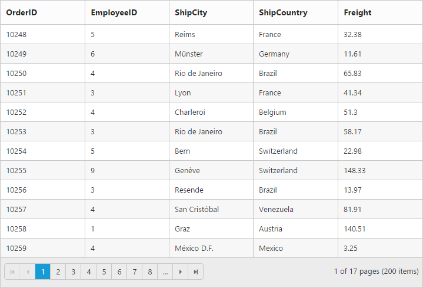
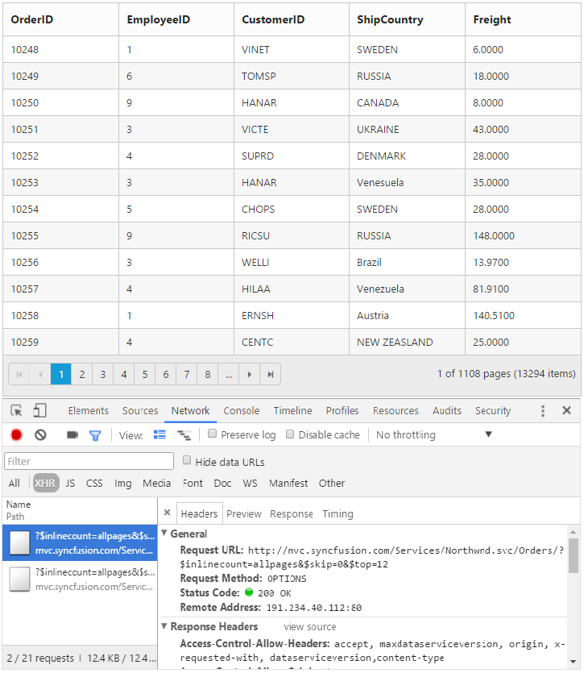

---
layout: post
title: DataBinding with Grid widget for Syncfusion Essential Angular-2
description: How to bind in-memory JSON and remote web services in Grid
platform: Angular
control: Grid
documentation: ug
api: /api/angular2/grid
--- 
# Data binding

The Grid control uses `ej.DataManager` which supports both RESTful JSON data services binding and local JSON array binding.  The `dataSource` property can be assigned either with the instance of `ej.DataManger` or JSON data array collection. It supports different kinds of data binding methods such as

1. Local data
2. Remote data

## Local Data

To bind local data to the Grid, you can assign a JSON array to the `dataSource` property.

The following code example describes the above behavior.



<ej-grid id="Grid" [dataSource]="gridData" allowPaging="true">
    <e-columns>
        <e-column field="OrderID" headerText="OrderID"></e-column>
        <e-column field="EmployeeID" headerText="EmployeeID"></e-column>
        <e-column field="ShipCity" headerText="ShipCity"></e-column>
        <e-column field="ShipCountry" headerText="ShipCountry"></e-column>
        <e-column field="Freight" headerText="Freight"></e-column>
    </e-columns>
</ej-grid>




  
    import {Component, ViewEncapsulation} from '@angular/core';
     @Component({
      selector: 'ej-app',
      templateUrl: 'app/app.component.html',  //give the path file for Grid control html file.
     })
     export class AppComponent {
        public gridData;
        constructor()
        {
           //The datasource "window.gridData" is referred from 'http://js.syncfusion.com/demos/web/scripts/jsondata.min.js'
           this.gridData = window.gridData;
		}
     }
   


The following output is displayed as a result of the above code example.

N> 1. There is no in-built support to bind the XML data to the grid. But you can achieve this requirement with the help of [`custom adaptor`]concept. 
N> 2. Refer this [Knowledge Base link](http://www.syncfusion.com/kb/3377/how-to-process-xml-data-from-server-using-datamanager-and-bound-to-grid#) for bounding XML data to grid using custom adaptor. 

## Remote Data

To bind remote data to Grid Control, you can assign a service data as an instance of `ej.DataManager` to the `dataSource` property.

### OData

OData is a standardized protocol for creating and consuming data. You can provide the [OData service](http://www.odata.org/#) URL directly to the `ej.DataManager` class and then you can assign it to Grid `dataSource`.

The following code example describes the above behavior.



<ej-grid id="Grid" [dataSource]="gridData" allowPaging="true">
    <e-columns>
        <e-column field="OrderID"  headerText="OrderID"></e-column>
        <e-column field="EmployeeID" headerText="EmployeeID"></e-column>
        <e-column field="ShipCity" headerText="ShipCity"></e-column>
        <e-column field="ShipCountry" headerText="ShipCountry"></e-column>
        <e-column field="Freight" headerText="Freight"></e-column>
    </e-columns>
</ej-grid>





    import {Component, ViewEncapsulation} from '@angular/core';
    import {NorthwindService} from './services/northwind.service';
    @Component({
      selector: 'ej-app',
      templateUrl: 'app/app.component.html',  //give the path file for Grid control html file.
      providers:[NorthwindService]
    })
    export class AppComponent {
        public gridData;
        public dataManager;
    	constructor()
        {
             this.dataManager = ej.DataManager({
                    url: "http://mvc.syncfusion.com/Services/Northwnd.svc/Orders/", 
                    crossDomain:true
                });
             this.gridData = this.dataManager;
         }
    }
	


	
The following output is displayed as a result of the above code example.

N> By default, if no adaptor is specified for ej.DataMananger and only the url link is mentioned it will consider as ODataService. 
