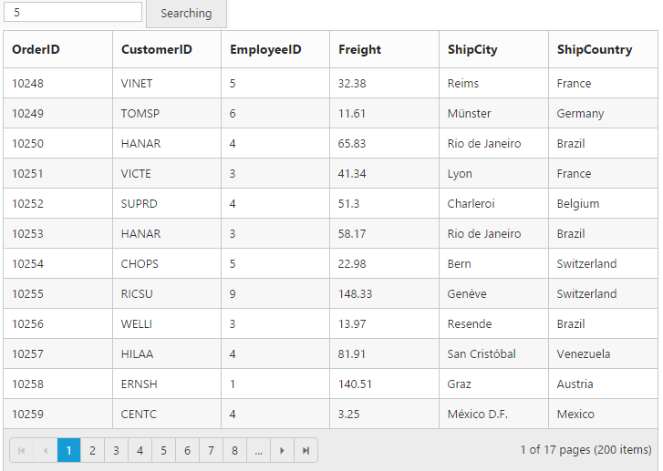

# How to

## Binding SignalR endpoint

Grid  supports SignalR features for live updates in record. Please find the below option to configure signalR with Grid. 

1) Before configure SignalR with ejGrid. You need to Setup SignalR configuration in Visual Studio project. For reference, please find the link.

N> Getting started with [SignalR](http://www.asp.net/signalr/overview/getting-started/tutorial-getting-started-with-signalr#setup "signalr") 

2) After configuration of SignalR, you have to create Hub for communication between different actions of grid. 


public class SignalHub: Hub

{

	public void modify(string action, string details)

	{

		Clients.All.modify(action, details);

	}

}



3) Implementation of SignalR communication with Grid through Hub.

<ej-grid id="Grid" #grid [dataSource]="gridData" [editSettings]="editSettings" [toolbarSettings]="toolbarSettings" [allowPaging]=true [allowSorting]=true (actionComplete)="actionComplete($event)">
    <e-columns>
        <e-column field="OrderID" [isPrimaryKey]="true" headerText="Order ID" width="75" textAlign="right"></e-column>
        <e-column field="CustomerID" headerText= 'Customer ID' width= "80"></e-column>
        <e-column field="EmployeeID" headerText='Employee ID' textAlign="right" width="75"></e-column>
        <e-column field="Freight" textAlign="right" width="75" format= "{0:C}" ></e-column>
        <e-column field="ShipCity" headerText='Ship City' width="110"  ></e-column>
    </e-columns>
</ej-grid>




    import {Component, ViewEncapsulation, ViewChild } from '@angular/core';
    @Component({
      selector: 'ej-app',
      templateUrl: 'app/app.component.html',  //give the path file for Grid control html file.
    })
    export class AppComponent {
        public gridData;
        public editSettings;
        public toolbarSettings;
        @ViewChild("grid") gridIns: EJComponents<any, any>;  
    	constructor()
        {
            //The datasource "(window as any).gridData" is referred from 'http://js.syncfusion.com/demos/web/scripts/jsondata.min.js'
            this.gridData = ej.DataManager((window as any).gridData).executeLocal(ej.Query().take(50));
            this.editSettings={allowAdding: true, allowEditing: true, allowDeleting: true };
            this.toolbarSettings={showToolbar: true, toolbarItems: [ej.Grid.ToolBarItems.Add, ej.Grid.ToolBarItems.Edit, ej.Grid.ToolBarItems.Delete, ej.Grid.ToolBarItems.Update, ej.Grid.ToolBarItems.Cancel]};
        }
        window.signal = $.connection.signalHub;
        window.signal.client.modify = function (action, details) {
          details = JSON.parse(details);
          if (action == "add") this.gridIns.widget.addRecord(details);
          else if (action == "beginedit") this.gridIns.widget.updateRecord("OrderID", details);
          else this.gridIns.widget.deleteRecord("OrderID", details);
        };
        $.connection.hub.start().done(function () {
          window.actionComplete = function (args) {
              if (args.requestType == "save" || args.requestType == "delete") window.signal.server.modify(args.requestType == "delete" ? args.requestType : window.previousAction, JSON.stringify(args.rowData));
              if (args.requestType != "delete") window.previousAction = args.requestType;
          }
        });
     }



## Copy data from Excel to Grid

Copy data from Excel to Grid is possible by converting Excel data to JSON data and then binding it to the Grid. Details are covered in this [blog](https://www.syncfusion.com/blogs/post/Copying-and-Pasting-Excel-Sheet-Data-to-Grid-ASPNET-MVC.aspx) post. 

## Prevent/Maintain persistence of properties

Grid actions can be persisted throughout by enabling the enablePersistence property of the Grid. However, we can maintain/prevent a grid action explicitly with the help of `addToPersist` and `ignoreOnPersist` methods respectively.


    <a href="http://www.syncfusion.com">Navigate to another Page</a>
    <ej-button id="Button" (click)="onClick($event)" text="Prevent/Maintain persistence"></ej-button>
    <ej-grid id="Grid" #grid [dataSource]="gridData" [allowFiltering]="true" [filterSettings]="filterSettings" [allowPaging]=true [allowGrouping]=true [enablePersistence]=true>
        <e-columns>
            <e-column field="OrderID" headerText="Order ID" width="75" textAlign="right"></e-column>
            <e-column field="CustomerID" headerText= 'Customer ID' width= "80"></e-column>
            <e-column field="EmployeeID" headerText='Employee ID' textAlign="right" width="75"></e-column>
            <e-column field="Freight" textAlign="right" width="75" format= "{0:C}" ></e-column>
        </e-columns>
    </ej-grid>
   


    import {Component, ViewEncapsulation, ViewChild } from '@angular/core';
    @Component({
      selector: 'ej-app',
      templateUrl: 'app/app.component.html',  //give the path file for Grid control html file.
    })
    export class AppComponent {
        public gridData;
        public filterSettings;
        @ViewChild("grid") gridIns: EJComponents<any, any>;  
    	constructor()
        {
            //The datasource "(window as any).gridData" is referred from 'http://js.syncfusion.com/demos/web/scripts/jsondata.min.js'
            this.gridData = (window as any).gridData;
            this.filterSettings={filterType: "menu"};
        }
        onClick(e:any){
            var gridObj = this.gridIns.widget;//get the gridObject
            // by default the enableAltRow property of the grid is true.
            gridObj.option("model.enableAltRow", false);   //set the enableAltRow property of the grid as false 
            //by default the filterSettings and groupSettings will be persisted upon navigating to another page.
            gridObj.ignoreOnPersist(["filterSettings", "groupSettings"]);// set the properties that are to be prevented from being persisted
            //by default the enableAltRow property of the grid will not be persisted
            gridObj.addToPersist("enableAltRow");// set the properties that are to be maintained for persistence.
            var toolbarObject = $(e.target),
            grid = this.gridIns.widget;
            if (toolbarObject.hasClass("Collapse")) grid.collapseAll(); //collapse Grid using grid instance, `this` is grid instance
            else grid.refreshContent(); //refresh content using grid instance
        }
     }


  So on navigating to another page by clicking on the link, by default the filterSettings and groupSettings will be persisted. But upon clicking the button and navigating, the persist state of the Grid actions are modified.
   
## External Search in Grid

Using [`search`](https://help.syncfusion.com/api/angular/ejgrid#methods:search “search”) method of Grid, you can search the string in Grid externally without using in-built toolbar search support. While using [`search`](https://help.syncfusion.com/api/angular/ejgrid#methods:search “search”) method it is necessary to set [`allowSearching`](https://help.syncfusion.com/api/angular/ejgrid#members:allowsearching “allowSearching”) property as `true`. The following code example explains the above behavior.


    <input type="text" id="searchString" class="e-ejinputtext" />
    <ej-button id="Button" (click)="onClick($event)" text="Searching"></ej-button>
    <ej-grid id="Grid" #grid [dataSource]="gridData" [allowSearching]="true" [filterSettings]="filterSettings" [allowPaging]=true [allowGrouping]=true [enablePersistence]=true>
        <e-columns>
            <e-column field="OrderID"></e-column>
            <e-column field="CustomerID"></e-column>
            <e-column field="EmployeeID"></e-column>
            <e-column field="Freight"></e-column>
            <e-column field="ShipCity"></e-column>
            <e-column field="ShipCountry"></e-column>
        </e-columns>
    </ej-grid>
   


import {Component, ViewEncapsulation, ViewChild } from '@angular/core';
    @Component({
      selector: 'ej-app',
      templateUrl: 'app/app.component.html',  //give the path file for Grid control html file.
    })
    export class AppComponent {
        public gridData;
        @ViewChild("grid") gridIns: EJComponents<any, any>;  
    	constructor()
        {
            //The datasource "(window as any).gridData" is referred from 'http://js.syncfusion.com/demos/web/scripts/jsondata.min.js'
            this.gridData = (window as any).gridData;
            
        }
        onClick(e:any){
            var obj = this.gridIns.widget;//get the gridObject
            var val = $("#searchString").val();
            obj.search(val);
        }
     }



The following output is displayed as a result of the above code example.

