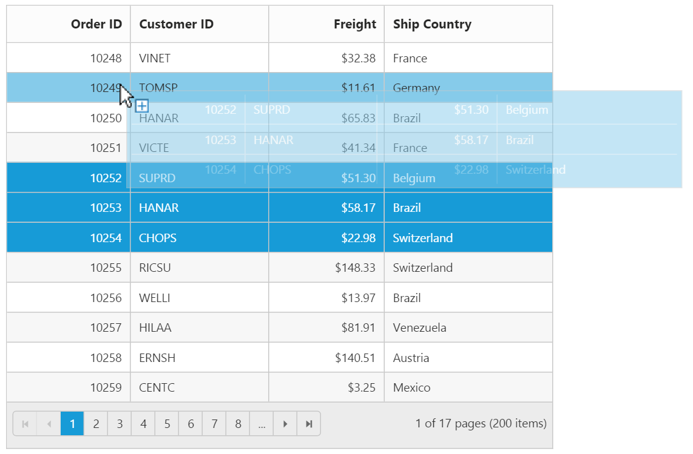
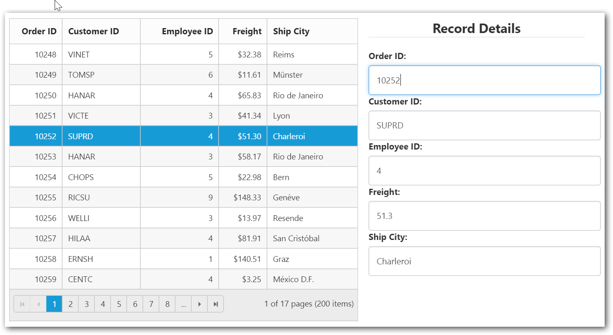

---
layout: post
title: Row with Grid widget for Syncfusion Essential Angular-2
description: How to use and customize the grid row
platform: Angular
control: Grid
documentation: ug
api: /api/Angular/grid
--- 
# Row

It represents the record details that are fetched from the datasource.

You can see the mouse hovering effect on the corresponding grid rows using [`enableRowHover`](https://help.syncfusion.com/api/angular/ejgrid#members:enablerowhover "enableRowHover") property. By default its value is `true`.

The following code example describes the above behavior.



 <ej-grid id="Grid" [dataSource]="gridData" [allowPaging]="true" [enableRowHover]="true">
    <e-columns>
        <e-column field="OrderID"  headerText="OrderID"></e-column>
        <e-column field="EmployeeID" headerText="EmployeeID"></e-column>
         <e-column field="ShipCity" headerText="ShipCity"></e-column>
        <e-column field="ShipCountry" headerText="ShipCountry"></e-column>
        <e-column field="Freight" headerText="Freight"></e-column>
       
    </e-columns>
 </ej-grid>





    import {Component, ViewEncapsulation} from '@angular/core';
    @Component({
      selector: 'ej-app',
      templateUrl: 'app/app.component.html',  //give the path file for Grid control html file.
    })
    export class AppComponent {
        public gridData;
        constructor()
        {
           //The datasource "window.gridData" is referred from 'http://js.syncfusion.com/demos/web/scripts/jsondata.min.js'
           this.gridData = window.gridData;
		}
     }



The following output is displayed as a result of the above code example.

## Details Template

It provides a detailed view /additional information about each row of the grid. On enabling details template, new column will be added in grid with an expander button in it and that can be expanded or collapsed to show or hide the underlying details of row respectively.

The following code example describes the above behavior.


<ej-grid #grid [allowPaging]="true" [allowSorting]="true" detailsTemplate="#tabGridContents" [dataSource]="gridData"  [allowGrouping]='true'  [pageSettings]='page' (detailsDataBound)="detailsDataBound($event)" >
    <e-columns>
        <e-column field="EmployeeID" headerText="Employee ID" [priority]=1 width="75" textAlign="right"></e-column>        
        <e-column field="FirstName" headerText="First Name" [priority]=2 width="80"></e-column>
               
    </e-columns>
     <ng-template #tabGridContents e-details-template let-data> 
    
         <ej-tab [(selectedItemIndex)]="selectIndex">
         <ul>
           <li><a href="#Grid">Stock Grid</a></li>       
        </ul>
    

        <ej-grid [allowPaging]="true" [editSettings]="editsettings" [pageSettings.pageSize]="pagesize" [dataSource]="data.DetailsData">
            <e-columns>
                <e-column field="OrderID"  headerText="OrderID"></e-column>
                <e-column field="EmployeeID" headerText="EmployeeID"></e-column>
                <e-column field="ShipCity" headerText="ShipCity"></e-column>
                <e-column field="ShipCountry" headerText="ShipCountry"></e-column>
                <e-column field="Freight" headerText="Freight"></e-column>
            </e-columns>
        </ej-grid> 
    

    
</ej-tab>  
            
     </ng-template> 

</ej-grid>




import {Component, ViewEncapsulation} from '@angular/core';
    @Component({
      selector: 'ej-app',
      templateUrl: 'app/app.component.html',  //give the path file for Grid control html file.
    })
    export class AppComponent {
        public gridData: any;
        public pagesize: number;
        editsettings: any;
        template: any;
        constructor()
        {
           //The datasource "window.employeeView" is referred from 'http://js.syncfusion.com/demos/web/scripts/jsondata.min.js'
           this.gridData = (window as any).employeeView;
		}
     }
     


The following output is displayed as a result of the above code example.

## Alternate row styling

Alternate row styling enhances the readability of grid rows by setting different background color for every alternate row. You can enable the alternative row styling in grid by using [`enableAltRow`](https://help.syncfusion.com/api/angular/ejgrid#members:enablealtrow "enableAltRow") property. 

By default its value is `true`, so the following code example describes the how to turn off alternate row behavior.



 <ej-grid id="Grid" [dataSource]="gridData" [allowPaging]="true" [enableAltRow]="false">
    <e-columns>
        <e-column field="OrderID"  headerText="OrderID"></e-column>
        <e-column field="EmployeeID" headerText="EmployeeID"></e-column>
         <e-column field="ShipCity" headerText="ShipCity"></e-column>
        <e-column field="ShipCountry" headerText="ShipCountry"></e-column>
        <e-column field="Freight" headerText="Freight"></e-column>
       
    </e-columns>
 </ej-grid>





    import {Component, ViewEncapsulation} from '@angular/core';
    @Component({
      selector: 'ej-app',
      templateUrl: 'app/app.component.html',  //give the path file for Grid control html file.
    })
    export class AppComponent {
        public gridData;
        constructor()
        {
           //The datasource "window.gridData" is referred from 'http://js.syncfusion.com/demos/web/scripts/jsondata.min.js'
           this.gridData = window.gridData;
		}
     }



The following output is displayed as a result of the above code example.

## Drag-and-Drop

Grid rows can be reordered, dropped to another Grid or custom control by enabling [`allowRowDragAndDrop`](https://help.syncfusion.com/api/angular/ejgrid#members:allowrowdraganddrop "allowRowDragAndDrop") Grid property.

N> To enable selection of multiple rows by mouse dragging on Grid rows, [`selectionType`](https://help.syncfusion.com/api/angular/ejgrid#members:selectiontype "selectionType") property of Grid must be set to `multiple`.

### Reorder

By simply enabling the property [`allowRowDragAndDrop`](https://help.syncfusion.com/api/angular/ejgrid#members:allowrowdraganddrop "allowRowDragAndDrop"), Grid rows can be reordered within the same Grid.

The following code example describes the above behavior.



 <ej-grid id="Grid" [dataSource]="gridData" [allowPaging]="true" [allowRowDragAndDrop]="true" [selectionType]="multiple">
    <e-columns>
        <e-column field="OrderID"  headerText="Order ID" [isPrimaryKey]="true" textAlign="right" width="80"></e-column>
        <e-column field="CustomerID" headerText="Customer ID" width="90"></e-column>
         <e-column field="Freight" headerText="Freight" textAlign="right" width="75" format="{0:C}"></e-column>
        <e-column field="ShipCountry" headerText="Ship Country" width="110"></e-column>
    </e-columns>
 </ej-grid>





    import {Component, ViewEncapsulation} from '@angular/core';
    @Component({
      selector: 'ej-app',
      templateUrl: 'app/app.component.html',  //give the path file for Grid control html file.
    })
    export class AppComponent {
        public gridData;
        constructor()
        {
           //The datasource "window.gridData" is referred from 'http://js.syncfusion.com/demos/web/scripts/jsondata.min.js'
           this.gridData = window.gridData;
		}
     }



The following output is displayed before reordering rows. 

{:Before Drop}

The following output is displayed after reordering rows.

{:After Drop}

### Grid-to-Grid

To drag and drop rows between two Grid, enable the Grid property [`allowRowDragAndDrop`](https://help.syncfusion.com/api/angular/ejgrid#members:allowrowdraganddrop "allowRowDragAndDrop") and specify the target Grid ID in [`dropTargetID`](https://help.syncfusion.com/api/angular/ejgrid#members:rowdropsettings-droptargetid "dropTargetID") property of Grid [`rowDropSettings`](https://help.syncfusion.com/api/angular/ejgrid#members:rowdropsettings "rowDropSettings").

The following code example describes the above behavior.



 

 <ej-grid id="Grid" [dataSource]="gridData" [allowPaging]="true" [allowRowDragAndDrop]="true" [selectionType]="multiple" [rowDropSettings.dropTargetID]="Gridid">
    <e-columns>
        <e-column field="OrderID"  headerText="Order ID" [isPrimaryKey]="true" textAlign="right" width="80"></e-column>
        <e-column field="CustomerID" headerText="Customer ID" width="90"></e-column>
        <e-column field="Freight" headerText="Freight" textAlign="right" width="75" format="{0:C}"></e-column>
        <e-column field="ShipCountry" headerText="Ship Country" width="110"></e-column>
   </e-columns>
</ej-grid>

<ej-grid id="DestinationGrid" [dataSource]=[] [allowPaging]="true" [allowRowDragAndDrop]="true" [selectionType]="multiple" [rowDropSettings.dropTargetID]="Gridtarget">
    <e-columns>
        <e-column field="OrderID"  headerText="Order ID" [isPrimaryKey]="true" textAlign="right" width="80"></e-column>
        <e-column field="CustomerID" headerText="Customer ID" width="90"></e-column>
        <e-column field="Freight" headerText="Freight" textAlign="right" width="75" format="{0:C}"></e-column>
        <e-column field="ShipCountry" headerText="Ship Country" width="110"></e-column>
   </e-columns>
</ej-grid>





    import {Component, ViewEncapsulation} from '@angular/core';
    @Component({
      selector: 'ej-app',
      templateUrl: 'app/app.component.html',  //give the path file for Grid control html file.
    })
    export class AppComponent {
        public gridData;
        public Gridid = "#DestinationGrid";
        public Gridtarget = "#Grid";
        constructor()
        {
           //The datasource "window.gridData" is referred from 'http://js.syncfusion.com/demos/web/scripts/jsondata.min.js'
           this.gridData = window.gridData;
         }
     }



The following output is displayed before dropping Grid rows.

{:Before Drop}

The following output is displayed after dropping Grid rows.

{:After Drop}

### Grid-to-Custom control

You can also drag and drop grid rows to any custom control. For instance, let it be a form.

Enable the Grid property [`allowRowDragAndDrop`](https://help.syncfusion.com/api/angular/ejgrid#members:allowrowdraganddrop "allowRowDragAndDrop") and specify the target form element ID in [`dropTargetID`](https://help.syncfusion.com/api/js/ejgrid#members:rowdropsettings-droptargetid "dropTargetID") property of Grid [`rowDropSettings`](https://help.syncfusion.com/api/angular/ejgrid#members:rowdropsettings "rowDropSettings").

The following code example describes the above behavior.



<form role="form" id="dropForm" style="width:98%">
                        <fieldset style="text-align:center; font-weight:700"><legend>Record Details</legend></fieldset>
                        

                            <label for="OrderID">Order ID:</label>
                            <input class="form-control" name="OrderID">
                        

                        

                            <label for="CustomerID">Customer ID:</label>
                            <input name="CustomerID" class="form-control">
                        

                        

                            <label for="EmployeeID">Employee ID:</label>
                            <input name="EmployeeID" class="form-control">
                        

                        

                            <label for="Freight">Freight:</label>
                            <input name="Freight" class="form-control">
                        

                        

                            <label for="ShipCity">Ship City:</label>
                            <input name="ShipCity" class="form-control">
                        

                         
                    </form>
                





 

 <ej-grid id="Grid" [dataSource]="gridData" [allowPaging]="true" [allowRowDragAndDrop]="true" [selectionType]="multiple" [rowDropSettings.dropTargetID]="dropForm" (rowDrop)="rowDropHandler($event)">
    <e-columns>
        <e-column field="OrderID"  headerText="Order ID" [isPrimaryKey]="true" textAlign="right" width="80"></e-column>
        <e-column field="CustomerID" headerText="Customer ID" width="120"></e-column>
        <e-column field="EmployeeID" headerText="Employee ID" width="120" textAlign="right" ></e-column>
        <e-column field="Freight" headerText="Freight" textAlign="right" width="75" format="{0:C}"></e-column>
        <e-column field="ShipCountry" headerText="Ship City" width="140"></e-column>
    </e-columns>
 </ej-grid>





    import {Component, ViewEncapsulation} from '@angular/core';
    @Component({
      selector: 'ej-app',
      templateUrl: 'app/app.component.html',  //give the path file for Grid control html file.
    })
    export class AppComponent {
        public gridData;
        public rowDropHandler(e){ 
	        for (var key in e.rowData[0]) {
                $('#dropForm input[name=' + key + ']').val(e.rowData[0][key]);
            }
	     }
        constructor()
        {
           //The datasource "window.gridData" is referred from 'http://js.syncfusion.com/demos/web/scripts/jsondata.min.js'
           this.gridData = window.gridData;
		}
     }



The following output is displayed before dropping the rows on Form.

{:Before Drop}

The following output is displayed after dropping the rows on Form.

{:After Drop}

N>   The default behavior of drag and drop between Grid or any other controls is as cut and paste. For copy and paste behavior specify the drag behavior in [`dragBehavior`](https://help.syncfusion.com/api/angular/ejgrid#members:rowdropsettings-dragbehavior "dragBehavior") property of [`rowDropSettings`](https://help.syncfusion.com/api/angular/ejgrid#members:rowdropsettings "rowDropSettings")  as ej.Grid.DragBehavior.Copy.

