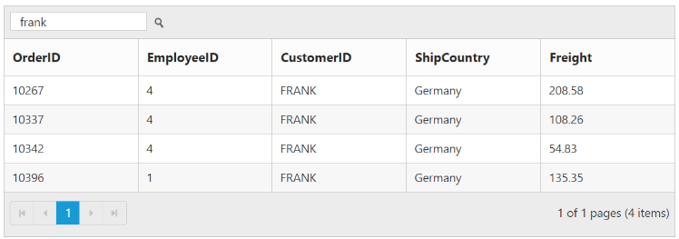

---
layout: post
title: Searching in Angular Grid Control | Syncfusion
description: Learn here all about Searching support in Syncfusion Essential Angular Grid control, its elements, and more.
platform: Angular
control: Grid
documentation: ug
api: /api/Angular/grid
--- 
# Searching in Essential Angular Grid

The grid has an option to search its content using the JavaScript method [`search`](https://help.syncfusion.com/api/angular/ejgrid#methods:search "search") with search key as parameter. Also, it provides an option to integrate Search text box in grid toolbar, by adding `search` toolbar item in [`toolbarSetting.toolbarItems`](https://help.syncfusion.com/api/angular/ejgrid#members:toolbarsettings-toolbaritems "toolbarSetting.toolbarItems") property.

The following code example describes the above behavior.



<ej-grid id="Grid" [dataSource]="gridData" [allowPaging]="true" [allowSearching]="true" [toolbarSettings]="toolbarItems" >
    <e-columns>
        <e-column field="OrderID" headerText="OrderID" width="75"></e-column>
        <e-column field="EmployeeID" headerText="EmployeeID"  width="80"></e-column>
        <e-column field="CustomerID" headerText="CustomerID" width="80"></e-column>
        <e-column field="ShipCountry" headerText="ShipCountry" width="90"></e-column>
        <e-column field="Freight" headerText="Freight" width="90" ></e-column>
    </e-columns>
 </ej-grid>





import {Component, ViewEncapsulation} from '@angular/core';
    @Component({
      selector: 'ej-app',
      templateUrl: 'app/app.component.html',  //give the path file for Grid control html file.
    })
    export class AppComponent {
        public gridData;
		public toolbarItems;
        constructor()
        {
           //The datasource "window.gridData" is referred from 'http://js.syncfusion.com/demos/web/scripts/jsondata.min.js'
           this.gridData = window.gridData;
		   this.toolbarItems = { showToolbar : true, toolbarItems : ["search"] };
		}
     }



The following output is displayed as a result of the above code example.

## Initial Searching

While initializing the grid, there is an option to display only the searched data in grid. To perform initial searching, define `fields`, `operator`, `key` and `ignoreCase` in `searchSettings` property.

N> `key` value must be passed as `string`.

The following code example describes the above behavior.



<ej-grid id="Grid" [dataSource]="gridData" [allowPaging]="true" [allowSearching]="true" [toolbarSettings]="toolbarItems" [searchSettings]="searchItems" >
    <e-columns>
        <e-column field="OrderID" headerText="OrderID" width="75"></e-column>
        <e-column field="EmployeeID" headerText="EmployeeID"  width="80"></e-column>
        <e-column field="CustomerID" headerText="CustomerID" width="80"></e-column>
        <e-column field="ShipCountry" headerText="ShipCountry" width="90"></e-column>
        <e-column field="Freight" headerText="Freight" width="90" ></e-column>
    </e-columns>
 </ej-grid>





import {Component, ViewEncapsulation} from '@angular/core';
    @Component({
      selector: 'ej-app',
      templateUrl: 'app/app.component.html',  //give the path file for Grid control html file.
    })
    export class AppComponent {
        public gridData;
		public toolbarItems;
        public searchItems;
        constructor()
        {
           //The datasource "window.gridData" is referred from 'http://js.syncfusion.com/demos/web/scripts/jsondata.min.js'
           this.gridData = window.gridData;
		   this.toolbarItems = { showToolbar : true, toolbarItems : ["search"] };
           this.searchItems = { fields: ["CustomerID"], operator: "contains", key: "frank", ignoreCase: false };
		}
     }



The following output is displayed as a result of the above code example.

List of supported operators in searching.

<table>
<tr>
<td>
ej.FilterOperators.equal</td></tr>
<tr>
<td>
ej.FilterOperators.notEqual</td></tr>
<tr>
<td>
ej.FilterOperators.startsWith</td></tr>
<tr>
<td>
ej.FilterOperators.endsWith</td></tr>
<tr>
<td>
ej.FilterOperators.contains</td></tr>
</table>
