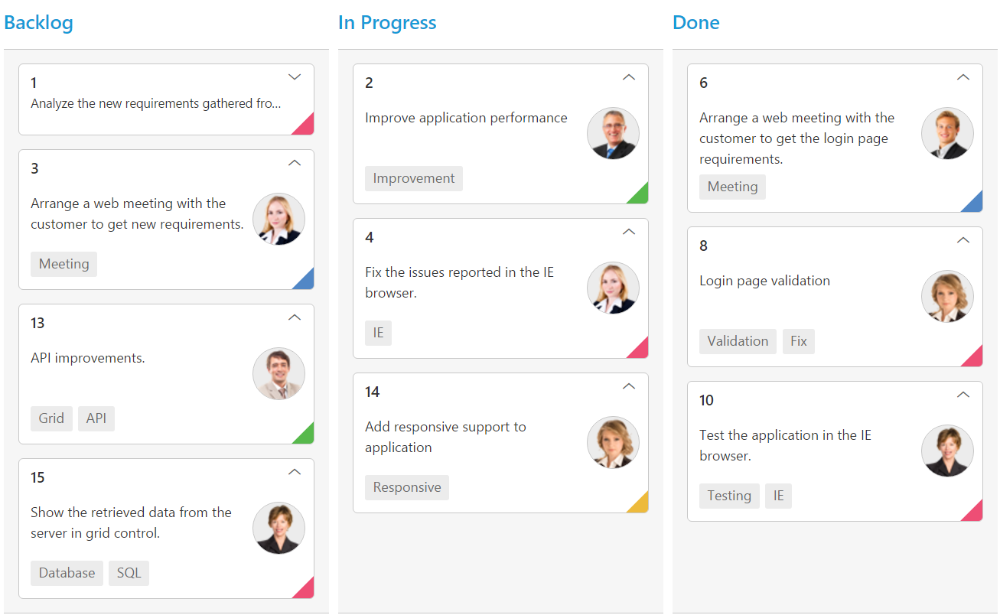
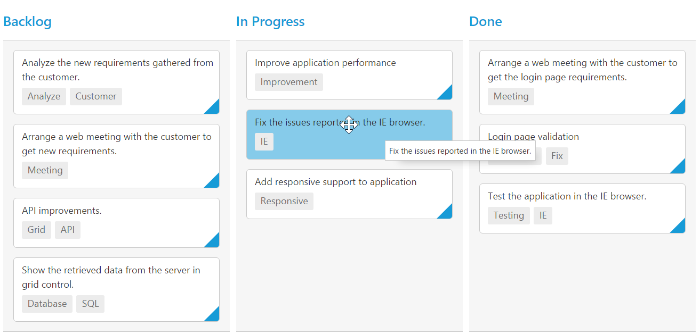

# Cards

## Customization

Cards can be customized with appropriate mapping fields from the database. The customizable mapping properties are listed as follows 

<table>
<tr>
<th>
Mapping Fields</th><th>
Description</th></tr>
<tr>
<td>
{{ '[fields.content](https://help.syncfusion.com/api/js/ejkanban#members:fields-content)' | markdownify }} </td><td> Map the column name to use as content to cards.</td></tr>
<tr>
<td>
{{ '[fields.tag](https://help.syncfusion.com/api/js/ejkanban#members:fields-tag)' | markdownify }} </td><td>
Map the column name to use as tag. Multiple tags can be given with comma separated.  E.g. "API","SQL, Database".</td></tr>
<tr>
<td>
{{ '[fields.color](https://help.syncfusion.com/api/js/ejkanban#members:fields-color)' | markdownify }} </td><td>
 Map the column name to use as colors to highlight cards left border.</td></tr>
<tr>
<td>
{{ '[cardSettings.colorMapping](https://help.syncfusion.com/api/js/ejkanban#members:cardsettings.colormapping)' | markdownify }} </td><td>
Map the colors to use with column values which is mapped with `fields.color`.</td></tr>
<tr>
<td>
{{ '[fields.imageUrl](https://help.syncfusion.com/api/js/ejkanban#members:fields-imgurl)' | markdownify }} </td><td>
Map the column name to use as image to cards.</td></tr>
<tr>
<td>
{{ '[fields.primaryKey](https://help.syncfusion.com/api/js/ejkanban#members:fields-primarykey)' | markdownify }} </td><td>
Map the column name to use as primary key to cards.</td></tr>
<tr>
<td>
{{ '[fields.priority](https://help.syncfusion.com/api/js/ejkanban#members:fields-priority)' | markdownify }} </td><td>
Map the column name to use as priority to cards.</td></tr>
<tr>
<td>
{{ '[fields.title](https://help.syncfusion.com/api/js/ejkanban#members:fields-title)' | markdownify }} </td><td>
Map the column name to use as title to cards. Default title is  `primaryKey`.</td></tr>
<tr>
<td>
{{ '[allowTitle](https://help.syncfusion.com/api/js/ejkanban#members:allowtitle)' | markdownify }} </td><td>
Set as true to enable title for card.</td></tr>
</table>

The following code example describes the above behavior.



<ej-kanban [dataSource]="kanbanData" keyField="Status" fields.content="Summary" fields.primaryKey="Id" fields.priority="RankId" fields.tag="Tags" fields.color="Type" fields.imageUrl="ImgUrl" allowTitle="true" [cardSettings.colorMapping]="color" [query]="query">
    <e-kanban-columns>
        <e-kanban-column key="Open" headertext="Backlog"></e-kanban-column>
        <e-kanban-column key="InProgress" headertext="In Progress"></e-kanban-column>
        <e-kanban-column key="Close" headertext="Done"></e-kanban-column>
    </e-kanban-columns>
</ej-kanban>





import { Component } from '@angular/core';
import { NorthwindService } from '../../services/northwind.service';

@Component({
  selector: 'ej-app',
  templateUrl: 'app/components/kanban/default.component.html',
  providers: [NorthwindService]
})
export class DefaultComponent {
  public kanbanData: any;
    constructor(private northwindService: NorthwindService) {
        this.kanbanData = northwindService.getTasks();
        this.query = ej.Query().from('kanbanData').take(20);
    }
    color = {
        "#cb2027": "Bug,Story",
        "#67ab47": "Improvement",
        "#fbae19": "Epic",
        "#6a5da8": "Others"
    };
}
    


The following output is displayed as a result of the above code example.

## Tooltip

You can enable HTML tooltip for Kanban card elements by setting [`tooltipSettings.enable`](https://help.syncfusion.com/api/js/ejkanban#members:tooltipsettings-enable) property as true in [`tooltipSettings`](https://help.syncfusion.com/api/js/ejkanban#members:tooltipsettings).

The following code example describes the above behavior.



<ej-kanban [dataSource]="kanbanData" keyField="Status" fields.primaryKey="Id" fields.content="Summary" fields.tag="Tags" [tooltipSettings.enable]="true" [query]="query">
    <e-kanban-columns>
        <e-kanban-column key="Open" headerText="Backlog"></e-kanban-column>
        <e-kanban-column key="InProgress" headerText="In Progress"></e-kanban-column>
        <e-kanban-column key="Close" headerText="Done"></e-kanban-column>
    </e-kanban-columns>
</ej-kanban>





import { Component } from '@angular/core';
import { NorthwindService } from '../../services/northwind.service';

@Component({
  selector: 'ej-app',
  templateUrl: 'app/components/kanban/default.component.html',
  providers: [NorthwindService]
})
export class DefaultComponent {
  public kanbanData: any;
    constructor(private northwindService: NorthwindService) {
        this.kanbanData = northwindService.getTasks();
        this.query = ej.Query().from('kanbanData').take(20);
    }
}


 
The following output is displayed as a result of the above code example.

