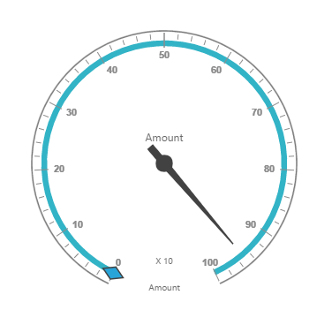

# Getting Started

This section explains briefly about how to create a **PivotGauge** control in your application with **Angular**. This section covers only the minimal features that you need to know to get started with the PivotGauge.

## Script and CSS Reference

Create a **HTML** page and add the scripts and CSS references in the order mentioned in the following code example.



    <!DOCTYPE html>
    <html>
    <head> 
        <link href="//cdn.syncfusion.com/14.3.0.49/js/web/flat-azure/ej.web.all.min.css" rel="stylesheet" />
        
        
        
        
        
        
        
        
        
        
    </head>
    <body>
    <ej-app>Loading...</ej-app>
    </body>
    </html>



In the above code, `ej.web.all.min.js`script reference has been added for demonstration purpose. It is not recommended to use this for deployment purpose, as its file size is larger since it contains all the widgets. Instead, you can use[`CSG`](http://csg.syncfusion.com "CSG")utility to generate a custom script file with the required widgets for deployment purpose.

## Relational

This section covers the information that you need to know to populate a simple PivotGauge with Relational data source.

### Control Initialization

Add necessary HTML elements to render PivotGauge



    <ej-pivotgauge [dataSource.data]="data" [dataSource.rows]="rows" [dataSource.columns]="columns" [dataSource.values]="values" [isResponsive]="true" [enableTooltip]="true" [backgroundColor]="transparent" [scales]="scales" >
    </ej-pivotgauge>





    import {Component, ViewEncapsulation} from '@angular/core';

    @Component({
    selector: 'sd-home',
    templateUrl: 'app/components/pivotgauge/pivotgauge.component.html', //give the path file for pivotgauge component html file.
    styleUrls: ['app/components/pivotgauge/pivotgauge.component.css'],  //give the path file for pivotgauge component css file.
    })
    export class PivotGaugeComponent {
    }



Create a **CSS** page and add necessary CSS elements for PivotGauge



    ej-pivotgauge{
        height: 340px; 
        width: 100%; 
        overflow: auto; 
        float: left; 
        position:relative
    }



### Populate PivotGauge with data

Let us now see how to populate the PivotGauge control using a sample JSON data as shown below.



    <ej-pivotgauge [dataSource.data]="data" [dataSource.rows]="rows" [dataSource.columns]="columns" [dataSource.values]="values" [isResponsive]="true" [enableTooltip]="true" [backgroundColor]="transparent" [scales]="scales" >
    </ej-pivotgauge>





    import {Component, ViewEncapsulation} from '@angular/core';

    @Component({
    selector: 'sd-home',
    templateUrl: 'app/components/pivotgauge/pivotgauge.component.html', //give the path file for pivotgauge component html file.
    styleUrls: ['app/components/pivotgauge/pivotgauge.component.css'],  //give the path file for pivotgauge component css file.
    })
    export class PivotGaugeComponent {
        public data; rows; columns;values; 
        constructor() {
        this.data = [
              { Amount: 100, Country: "Canada", Date: "FY 2005", Product: "Bike", Quantity: 2, State: "Alberta" },
            { Amount: 200, Country: "Canada", Date: "FY 2006", Product: "Van", Quantity: 3, State: "British Columbia" },
            { Amount: 300, Country: "Canada", Date: "FY 2007", Product: "Car", Quantity: 4, State: "Brunswick" },
            { Amount: 150, Country: "Canada", Date: "FY 2008", Product: "Bike", Quantity: 3, State: "Manitoba" },
            { Amount: 200, Country: "Canada", Date: "FY 2006", Product: "Car", Quantity: 4, State: "Ontario" },
            { Amount: 100, Country: "Canada", Date: "FY 2007", Product: "Van", Quantity: 1, State: "Quebec" },
            { Amount: 200, Country: "France", Date: "FY 2005", Product: "Bike", Quantity: 2, State: "Charente-Maritime" },
            { Amount: 250, Country: "France", Date: "FY 2006", Product: "Van", Quantity: 4, State: "Essonne" },
            { Amount: 300, Country: "France", Date: "FY 2007", Product: "Car", Quantity: 3, State: "Garonne (Haute)" },
            { Amount: 150, Country: "France", Date: "FY 2008", Product: "Van", Quantity: 2, State: "Gers" },
            { Amount: 200, Country: "Germany", Date: "FY 2006", Product: "Van", Quantity: 3, State: "Bayern" },
            { Amount: 250, Country: "Germany", Date: "FY 2007", Product: "Car", Quantity: 3, State: "Brandenburg" },
            { Amount: 150, Country: "Germany", Date: "FY 2008", Product: "Car", Quantity: 4, State: "Hamburg" },
            { Amount: 200, Country: "Germany", Date: "FY 2008", Product: "Bike", Quantity: 4, State: "Hessen" },
            { Amount: 150, Country: "Germany", Date: "FY 2007", Product: "Van", Quantity: 3, State: "Nordrhein-Westfalen" },
            { Amount: 100, Country: "Germany", Date: "FY 2005", Product: "Bike", Quantity: 2, State: "Saarland" },
            { Amount: 150, Country: "United Kingdom", Date: "FY 2008", Product: "Bike", Quantity: 5, State: "England" },
            { Amount: 250, Country: "United States", Date: "FY 2007", Product: "Car", Quantity: 4, State: "Alabama" },
            { Amount: 200, Country: "United States", Date: "FY 2005", Product: "Van", Quantity: 4, State: "California" },
            { Amount: 100, Country: "United States", Date: "FY 2006", Product: "Bike", Quantity: 2, State: "Colorado" },
            { Amount: 150, Country: "United States", Date: "FY 2008", Product: "Car", Quantity: 3, State: "New Mexico" },
            { Amount: 200, Country: "United States", Date: "FY 2005", Product: "Bike", Quantity: 4, State: "New York" },
            { Amount: 250, Country: "United States", Date: "FY 2008", Product: "Car", Quantity: 3, State: "North Carolina" },
            { Amount: 300, Country: "United States", Date: "FY 2007", Product: "Van", Quantity: 4, State: "South Carolina" }
        ];
        this.rows = [{ fieldName: "Country", fieldCaption: "Country" }, { fieldName: "State", fieldCaption: "State" }];
        this.columns = [{ fieldName: "Product", fieldCaption: "Product" }];
        this.values = [{ fieldName: "Amount", fieldCaption: "Amount" }, { fieldName: "Quantity", fieldCaption: "Quantity" }];
        this.scales = [{
                            showRanges: true,
                            radius: 150, showScaleBar: true, size: 1,
                            border: {
                                width: 0.5
                            },
                            showIndicators: true, showLabels: true,
                            pointers: [{
                                    showBackNeedle: true,
                                    backNeedleLength: 20,
                                    length: 120,
                                    width: 7
                                },
                                {
                                    type: "marker",
                                    markerType: "diamond",
                                    distanceFromScale: 5,
                                    placement: "center",
                                    backgroundColor: "#29A4D9",
                                    length: 25,
                                    width: 15
                                }],
                            ticks: [{
                                    type: "major",
                                    distanceFromScale: 2,
                                    height: 16,
                                    width: 1, color: "#8c8c8c"
                                },
                                {
                                    type: "minor",
                                    height: 6,
                                    width: 1,
                                    distanceFromScale: 2,
                                    color: "#8c8c8c"
                                }],
                            labels: [{
                                    color: "#8c8c8c"
                                }],
                            ranges: [{
                                    distanceFromScale: -5,
                                    backgroundColor: "#fc0606",
                                    border: { color: "#fc0606" }
                                }, {
                                    distanceFromScale: -5
                                }],
                            customLabels: [{
                                    position: { x: 180, y: 290 },
                                    font: { size: "10px", fontFamily: "Segoe UI", fontStyle: "Normal" }, color: "#666666"
                                }, {
                                    position: { x: 180, y: 320 },
                                    font: { size: "10px", fontFamily: "Segoe UI", fontStyle: "Normal" }, color: "#666666"
                                }, {
                                    position: { x: 180, y: 150 },
                                    font: { size: "12px", fontFamily: "Segoe UI", fontStyle: "Normal" }, color: "#666666"
                                }]
                        }];
        }
}



The above code will generate a simple PivotGauge as shown in below figure.

## OLAP

This section covers the information that you need to know to populate a simple PivotGauge with OLAP data source.

### Control Initialization

Add necessary HTML elements to render PivotGauge



    <ej-pivotgauge [dataSource.data]="data" [dataSource.catalog]="catalog" [dataSource.cube]="cube" [dataSource.rows]="rows" [dataSource.columns]="columns" [dataSource.values]="values" [isResponsive]="true" [enableTooltip]="true" [backgroundColor]="transparent" [scales]="scales" >
    </ej-pivotgauge>





    import {Component, ViewEncapsulation} from '@angular/core';

    @Component({
    selector: 'sd-home',
    templateUrl: 'app/components/pivotgauge/pivotgauge.component.html', //give the path file for pivotgauge component html file.
    styleUrls: ['app/components/pivotgauge/pivotgauge.component.css'],  //give the path file for pivotgauge component css file.
    })
    export class PivotGaugeComponent {
    }



Create a **CSS** page and add necessary CSS elements for PivotGauge



    ej-pivotgauge{
        height: 340px; 
        width: 100%; 
        overflow: auto; 
        float: left; 
        position:relative
    }



### Populate PivotGauge with data

Let us now see how to populate the PivotGauge control using a sample JSON data as shown below.



    <ej-pivotgauge [dataSource.data]="data" [dataSource.catalog]="catalog" [dataSource.cube]="cube" [dataSource.rows]="rows" [dataSource.columns]="columns" [dataSource.values]="values" [isResponsive]="true" [enableTooltip]="true" [backgroundColor]="transparent" [scales]="scales" >
    </ej-pivotgauge>





    import {Component, ViewEncapsulation} from '@angular/core';

    @Component({
    selector: 'sd-home',
    templateUrl: 'app/components/pivotgauge/pivotgauge.component.html', //give the path file for pivotgauge component html file.
    styleUrls: ['app/components/pivotgauge/pivotgauge.component.css'],  //give the path file for pivotgauge component css file.
    })
    export class PivotGaugeComponent {
    public data; cube; catalog; rows; columns;values;scales;
        constructor() {
        this.data = "http://bi.syncfusion.com/olap/msmdpump.dll";
        this.cube = "Adventure Works";
        this.catalog = "Adventure Works DW 2008 SE";
        this.rows = [{ fieldName: "[Date].[Fiscal]", filterItems: { filterType: "include", values: ["[Date].[Fiscal].[Fiscal Year].&amp;[2004]"] } }];
        this.columns = [{ fieldName: "[Customer].[Customer Geography]" }];
        this.values = [{ measures: [{ fieldName: "[Measures].[Internet Sales Amount]", }, { fieldName: "[Measures].[Internet Revenue Status]" }, { fieldName: "[Measures].[Internet Revenue Trend]" }, { fieldName: "[Measures].[Internet Revenue Goal]" },], axis: "columns" }];
        this.scales = [{
                            showRanges: true,
                            radius: 150, showScaleBar: true, size: 1,
                            border: {
                                width: 0.5
                            },
                            showIndicators: true, showLabels: true,
                            pointers: [{
                                    showBackNeedle: true,
                                    backNeedleLength: 20,
                                    length: 120,
                                    width: 7
                                },
                                {
                                    type: "marker",
                                    markerType: "diamond",
                                    distanceFromScale: 5,
                                    placement: "center",
                                    backgroundColor: "#29A4D9",
                                    length: 25,
                                    width: 15
                                }],
                            ticks: [{
                                    type: "major",
                                    distanceFromScale: 2,
                                    height: 16,
                                    width: 1, color: "#8c8c8c"
                                },
                                {
                                    type: "minor",
                                    height: 6,
                                    width: 1,
                                    distanceFromScale: 2,
                                    color: "#8c8c8c"
                                }],
                            labels: [{
                                    color: "#8c8c8c"
                                }],
                            ranges: [{
                                    distanceFromScale: -5,
                                    backgroundColor: "#fc0606",
                                    border: { color: "#fc0606" }
                                }, {
                                    distanceFromScale: -5
                                }],
                            customLabels: [{
                                    position: { x: 180, y: 290 },
                                    font: { size: "10px", fontFamily: "Segoe UI", fontStyle: "Normal" }, color: "#666666"
                                }, {
                                    position: { x: 180, y: 320 },
                                    font: { size: "10px", fontFamily: "Segoe UI", fontStyle: "Normal" }, color: "#666666"
                                }, {
                                    position: { x: 180, y: 150 },
                                    font: { size: "12px", fontFamily: "Segoe UI", fontStyle: "Normal" }, color: "#666666"
                                }]
                        }];
        }
}



The above code will generate a simple PivotGauge as shown in below figure.

