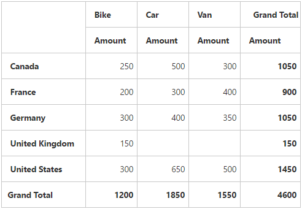

# Getting Started

This section explains briefly about how to create a **PivotGrid** control in your application with **Angular**. This section covers only the minimal features that you need to know to get started with the PivotGrid.

## Script and CSS Reference

Create a **HTML** page and add the scripts and CSS references in the order mentioned in the following code example.



    <!DOCTYPE html>
    <html>
      <head> 
        <link href="//cdn.syncfusion.com/14.3.0.49/js/web/flat-azure/ej.web.all.min.css" rel="stylesheet" />
        
        
        
        
        
        
        
        
        
        
      </head>
      <body>
      <ej-app>Loading...</ej-app>
      </body>
    </html>



In the above code, `ej.web.all.min.js` script reference has been added for demonstration purpose. It is not recommended to use this for deployment purpose, as its file size is larger since it contains all the widgets. Instead, you can use[`CSG`](http://csg.syncfusion.com "CSG")utility to generate a custom script file with the required widgets for deployment purpose.

## Relational

This section covers the information that you need to know to populate a simple PivotGrid with Relational data source.

### Control Initialization

Add necessary HTML elements to render PivotGrid



    <ej-pivotgrid [enableToolTip]="false" [dataSource.data]="data" [dataSource.rows]="rows" [dataSource.columns]="columns" [dataSource.values]="values">
    </ej-pivotgrid>





    import {Component, ViewEncapsulation} from '@angular/core';
    
    @Component({
      selector: 'sd-home',
      templateUrl: 'app/components/pivotgrid/pivotgrid.component.html', //give the path file for pivotgrid component html file.
      styleUrls: ['app/components/pivotgrid/pivotgrid.component.css'],  //give the path file for pivotgrid component css file.
    })
    export class PivotGridComponent {
    }



Create a **CSS** page and add necessary CSS elements for PivotGrid



    ej-pivotgrid {
        display: block;
        height: 450px;
        width: 100%; 
        overflow: auto;
    }
    
    .e-pivotgrid {
        position: inherit !important;
}



### Populate PivotGrid with data

Let us now see how to populate the PivotGrid control using a sample JSON data as shown below.



    <ej-pivotgrid [enableToolTip]="false" [dataSource.data]="data" [dataSource.rows]="rows" [dataSource.columns]="columns" [dataSource.values]="values">
    </ej-pivotgrid>





    import {Component, ViewEncapsulation} from '@angular/core';
    
    @Component({
      selector: 'sd-home',
      templateUrl: 'app/components/pivotgrid/pivotgrid.component.html', //give the path file for pivotgrid component html file.
      styleUrls: ['app/components/pivotgrid/pivotgrid.component.css'],  //give the path file for pivotgrid component css file.
    })
    export class PivotGridComponent {
        public data; rows; columns;values; 
        constructor() {
          this.data = [
              { Amount: 100, Country: "Canada", Date: "FY 2005", Product: "Bike", Quantity: 2, State: "Alberta" },
              { Amount: 200, Country: "Canada", Date: "FY 2006", Product: "Van", Quantity: 3, State: "British Columbia" },
              { Amount: 300, Country: "Canada", Date: "FY 2007", Product: "Car", Quantity: 4, State: "Brunswick" },
              { Amount: 150, Country: "Canada", Date: "FY 2008", Product: "Bike", Quantity: 3, State: "Manitoba" },
              { Amount: 200, Country: "Canada", Date: "FY 2006", Product: "Car", Quantity: 4, State: "Ontario" },
              { Amount: 100, Country: "Canada", Date: "FY 2007", Product: "Van", Quantity: 1, State: "Quebec" },
              { Amount: 200, Country: "France", Date: "FY 2005", Product: "Bike", Quantity: 2, State: "Charente-Maritime" },
              { Amount: 250, Country: "France", Date: "FY 2006", Product: "Van", Quantity: 4, State: "Essonne" },
              { Amount: 300, Country: "France", Date: "FY 2007", Product: "Car", Quantity: 3, State: "Garonne (Haute)" },
              { Amount: 150, Country: "France", Date: "FY 2008", Product: "Van", Quantity: 2, State: "Gers" },
              { Amount: 200, Country: "Germany", Date: "FY 2006", Product: "Van", Quantity: 3, State: "Bayern" },
              { Amount: 250, Country: "Germany", Date: "FY 2007", Product: "Car", Quantity: 3, State: "Brandenburg" },
              { Amount: 150, Country: "Germany", Date: "FY 2008", Product: "Car", Quantity: 4, State: "Hamburg" },
              { Amount: 200, Country: "Germany", Date: "FY 2008", Product: "Bike", Quantity: 4, State: "Hessen" },
              { Amount: 150, Country: "Germany", Date: "FY 2007", Product: "Van", Quantity: 3, State: "Nordrhein-Westfalen" },
              { Amount: 100, Country: "Germany", Date: "FY 2005", Product: "Bike", Quantity: 2, State: "Saarland" },
              { Amount: 150, Country: "United Kingdom", Date: "FY 2008", Product: "Bike", Quantity: 5, State: "England" },
              { Amount: 250, Country: "United States", Date: "FY 2007", Product: "Car", Quantity: 4, State: "Alabama" },
              { Amount: 200, Country: "United States", Date: "FY 2005", Product: "Van", Quantity: 4, State: "California" },
              { Amount: 100, Country: "United States", Date: "FY 2006", Product: "Bike", Quantity: 2, State: "Colorado" },
              { Amount: 150, Country: "United States", Date: "FY 2008", Product: "Car", Quantity: 3, State: "New Mexico" },
              { Amount: 200, Country: "United States", Date: "FY 2005", Product: "Bike", Quantity: 4, State: "New York" },
              { Amount: 250, Country: "United States", Date: "FY 2008", Product: "Car", Quantity: 3, State: "North Carolina" },
              { Amount: 300, Country: "United States", Date: "FY 2007", Product: "Van", Quantity: 4, State: "South Carolina" }
          ];
          this.rows = [{ fieldName: "Country", fieldCaption: "Country" }];
          this.columns = [{ fieldName: "Product", fieldCaption: "Product" }];
          this.values = [{ fieldName: "Amount", fieldCaption: "Amount" }];
        }
    }



The above code will generate a simple PivotGrid with “Country” field in Row, “Product” field in Column and “Amount” field in Value section.

## OLAP

This section covers the information that you need to know to populate a simple PivotGrid with OLAP data source.

### Control Initialization

Add necessary HTML elements to render PivotGrid



    <ej-pivotgrid [enableToolTip]="false" [dataSource.data]="data" [dataSource.catalog]="catalog" [dataSource.cube]="cube" [dataSource.rows]="rows" [dataSource.columns]="columns" [dataSource.values]="values">
    </ej-pivotgrid>





    import {Component, ViewEncapsulation} from '@angular/core';
    
    @Component({
      selector: 'sd-home',
      templateUrl: 'app/components/pivotgrid/pivotgrid.component.html', //give the path file for pivotgrid component html file.
      styleUrls: ['app/components/pivotgrid/pivotgrid.component.css'],  //give the path file for pivotgrid component css file.
    })
    export class PivotGridComponent {
    }



Create a **CSS** page and add necessary CSS elements for PivotGrid



    ej-pivotgrid {
        display: block;
        height: 450px;
        width: 100%; 
        overflow: auto;
    }
    
    .e-pivotgrid{
        position: inherit !important;
    }



### Populate PivotGrid with data

Let us now see how to populate the PivotGrid control using a sample JSON data as shown below.



    <ej-pivotgrid [enableToolTip]="false" [dataSource.data]="data" [dataSource.catalog]="catalog" [dataSource.cube]="cube" [dataSource.rows]="rows" [dataSource.columns]="columns" [dataSource.values]="values">
    </ej-pivotgrid>





    import {Component, ViewEncapsulation} from '@angular/core';
    
    @Component({
      selector: 'sd-home',
      templateUrl: 'app/components/pivotgrid/pivotgrid.component.html', //give the path file for pivotgrid component html file.
      styleUrls: ['app/components/pivotgrid/pivotgrid.component.css'],  //give the path file for pivotgrid component css file.
    })
    export class PivotGridComponent {
        public data; cube; catalog; rows; columns; values; filters;
        constructor() {
          this.data = "http://bi.syncfusion.com/olap/msmdpump.dll";
          this.cube = "Adventure Works";
          this.catalog = "Adventure Works DW 2008 SE";
          this.rows = [{ fieldName: "[Date].[Fiscal]" }];
          this.columns = [{ fieldName: "[Customer].[Customer Geography]" }];
          this.values = [{ measures: [{ fieldName: "[Measures].[Internet Sales Amount]", }], axis: "columns" }];
          this.filters = [];
        }
    }



The above code will generate a simple PivotGrid with “Fiscal” field in Row, “Customer Geography” field in Column and “Internet Sales Amount” field in Value section.

