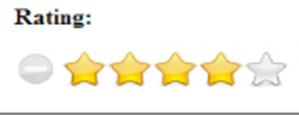
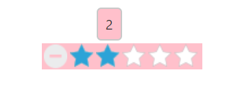

# Appearance and Styling

## Show ToolTip

**Rating** control provides support for **Tooltip** values. This is achieved by enabling the [showTooltip](https://help.syncfusion.com/api/js/ejrating#members:showtooltip) property to be **‘true’.** When you move the mouse over the Rating control it displays the Tooltip value as rating value. By default this property value is set to **‘true’**.

The following code example is used to render the **Rating** control without **tooltip**.

Add the following HTML to render Rating with Tooltip.



<ej-rating id="rating" [showTooltip]="false"></ej-rating>
    


The following screenshot illustrates **Rating** without **Tooltip**.

 

## Adjusting Rating Size

### Adjust Shape Width and Shape Height

You can customize the width and height of the **Rating** by [shapeWidth](https://help.syncfusion.com/api/js/ejrating#members:shapewidth) and [shapeHeight](https://help.syncfusion.com/api/js/ejrating#members:shapeheight) properties. These properties completely depend on rating image’s size. The shapeWidth and shapeHeight are adjusted within the rating image size.

The following code example is used to render the **Rating** control with customized **shapeWidth** and **shapeHeight**.

 Add the following HTML to render Rating with customized shapeWidth and shapeHeight.



<ej-rating id="rating" [value]="rate" [shapeWidth]="shapewidth" [shapeHeight]="shapeheight"> </ej-rating>
 
 
 


import { Component } from '@angular/core';
import {ViewEncapsulation} from '@angular/core'; 
@Component({
    selector: 'ej-app',
    templateUrl: 'src/rating/rating.component.html',
    styleUrls: ['src/rating/rating.component.css'],
    encapsulation: ViewEncapsulation.None 
})
export class RatingComponent {
    rate: number;
    shapewidth: number;
    shapeheight: number;
    constructor() {
        this.rate = 4;
        this.shapewidth = 29;
        this.shapeheight = 29;
    }
} 

 
Add the below CSS in external file named as rating.component.css



    .e-rating
    {
        margin-top: -7px;
    }    
    .e-rating.e-horizontal .e-shape-list, .e-rating.e-vertical .e-shape-list,
    .e-rating.e-horizontal .e-shape, .e-rating.e-vertical .e-shape, .e-rating.e-horizontal .e-ul,.e-rating.e-vertical .e-ul,.e-rating.e-horizontal .e-reset, .e-rating.e-vertical .e-reset 
    {
        height:28px;width:28px;
        background:url(images/crystal-stars.png) no-repeat;
    }
    .e-rating.e-horizontal .e-reset, .e-rating.e-vertical .e-reset {
        background-position: 0 42px;
        margin-left: 2px;
    }
       .e-rating.e-horizontal .e-shape-list
    {
        background-position: 0 -56px;
    }    
       .e-rating.e-horizontal .e-reset:hover
    {
        background-position: 0 42px;
    }
    .e-rating .e-shape.inactive 
    {
        background-position: 0 -56px;
    }
    .e-rating .e-shape.active {
        background-position: 0 -112px;
    }
    .e-rating .e-shape.selected {
        background-position: 0 -84px;
    }
    .e-tooltip {
        background-color:white;
        border:2px solid #b0c4de;
        color:black
    }    



The following screenshot illustrates **Rating** with customized **shapeWidth** and **shapeHeight**.

## Theme

**Rating** control’s style and appearance are controlled based on **CSS** classes. In order to apply styles to the Rating control, refer the files namely, **ej.widgets.core.min.css** and **ej.theme.min.css**. When the file **ej.widgets.all.min.css** is referred, then it is not necessary to include the files ej.widgets.core.min.css and ej.theme.min.css in your project, as **ej.widgets.all.min.css** is the combination of these both. 

By default, there are 12 themes support available for **Rating** control namely:

* default-theme
* flat-azure-dark
* fat-lime
* flat-lime-dark
* flat-saffron
* flat-saffron-dark
* gradient-azure
* gradient-azure-dark
* gradient-lime
* gradient-lime-dark
* gradient-saffron
* gradient-saffron-dark

## Custom styles

The style of the **Rating** control is customized by [cssClass](https://help.syncfusion.com/api/js/ejrating#members:cssclass) property. 

The following code example is used to render the **Rating** control with **customized** **style**.

 Add the following HTML to render Rating with customized style.



<ej-rating id="rating" cssClass="custom"> </ej-rating>





import { Component } from '@angular/core';
import {ViewEncapsulation} from '@angular/core'; 
@Component({
    selector: 'ej-app',
    templateUrl: 'src/rating/rating.component.html',
    styleUrls: ['src/rating/rating.component.css'],
    encapsulation: ViewEncapsulation.None 
})
export class RatingComponent {
   
}



Add the below CSS in external file named as rating.component.css



.custom {
       background-color: greenyellow;
}



The following screenshot illustrates the **Rating** with customized style.

