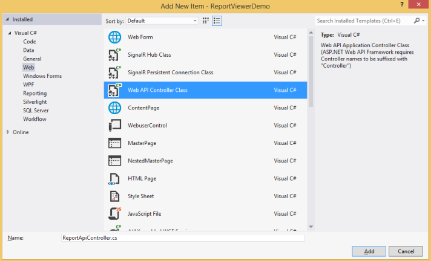
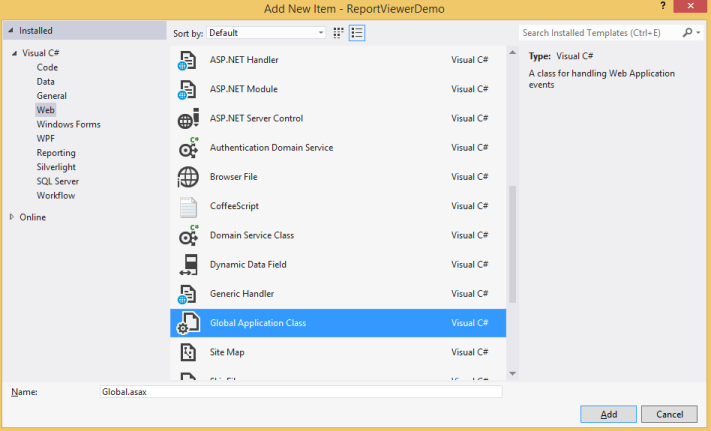

# Report Controller

The ReportViewer uses Web API services to process the report file, process the request from control and return the processed data from control to client side.

## IReportController

The interface `IReportController` has the declaration of action methods that is defined in WebApi Controller for processing the RDL/RDLC files and for processing request from ReportViewer control. The `IReportController` has the following action methods declaration. 

<table>
<tr>
<th>
Methods</th><th>
Description</th></tr>
<tr>
<td>
GetResource</td><td>
Action (HttpGet) method for getting resource for report. </td></tr>
<tr>
<td>
PostReportAction</td><td>
Action (HttpPost) method for posting the request for report process. </td></tr>
<tr>
<td>
PostFormReportAction</td><td>
Action (HttpPost) method for posting the request for report exporting. It requires only in ASP.NET Core platform</td></tr>
<tr>
<td>
OnInitReportOptions</td><td>
Report initialization method that is triggered when report begins to be processed.</td></tr>
<tr>
<td>
OnReportLoaded</td><td>
Report loaded method that is triggered when report and sub report begin loading.</td></tr>
</table>

## ReportHelper

The class `ReportHelper` contains helper methods that helps process Post/Get request from ReportViewer control and returns the response to ReportViewer control. The `ReportHelper` has the following methods. 

<table>
<tr>
<th>
Methods</th><th>
Description</th></tr>
<tr>
<td>
GetResource</td><td>
Returns the report resource for the requested key.</td></tr>
<tr>
<td>
ProcessReport</td><td>
Processes the report request and returns the result.</td></tr>
</table>

## Create a Web API Controller for .NET platform

ReportViewer uses WebApi services to process the report file and process the request from control.

 

Adding WebApi Controller
{:.caption}

### References
You should add the following assembly for the ReportViewer webAPI controller in .NET platform:

   * Syncfusion.Linq.Base
   * Syncfusion.Compression.Base
   * Syncfusion.EJ.ReportViewer
   * Syncfusion.Pdf.Base
   * Syncfusion.XlsIO.Base
   * Syncfusion.DocIO.Base
   * Syncfusion.Shared.Wpf
   * Syncfusion.Chart.Wpf
   * Syncfusion.Gauge.Wpf
   * Syncfusion.SfMaps.Wpf 
   * Syncfusion.Licensing
   * Syncfusion.OfficeChart.Base
   * Syncfusion.Presentation.Base

   N> Refer the above assemblies from the installed location, C:\Program Files (x86)\Syncfusion\Essential Studio\{platform}\{{ site.releaseversion }}\Assemblies
   N>
   N> Refer System.Web.Http, System. Web.Http.WebHost, System.Net.Http.WebRequest and System.Net.Http.Formatting assemblies from ASP.NET WebApi NuGet package.

### Inherit IReportController

The ApiController inherits the `IReportController` and you can add the following code example to its methods definition in order to process the report file. The interface `IReportController` contains the required actions and helper methods declaration to process the report. The `ReportHelper` class contains helper methods that helps to process Post/Get request from control and return the response to control.



using Syncfusion.EJ.ReportViewer;
using System;
using System.Collections.Generic;
using System.Linq;
using System.Net;
using System.Net.Http;
using System.Web.Http;

namespace ReportViewerDemo.Api 
{
    public class ReportApiController: ApiController,IReportController 
    {
        //Post action for processing the rdl/rdlc report 
        public object PostReportAction(Dictionary < string, object > jsonResult 
        {
            return ReportHelper.ProcessReport(jsonResult, this);
        }
        
        //Get action for getting resources from the report
        [System.Web.Http.ActionName("GetResource")]
        [AcceptVerbs("GET")]
        public object GetResource(string key, string resourceType, bool isPrint) 
        {
            return ReportHelper.GetResource(key, resourceType, isPrint);
        }
        
        //Method will be called when initialize the report options before start processing the report        
        public void OnInitReportOptions(ReportViewerOptions reportOption)
        {
            //You can update report options here
        }
        
        //Method will be called when reported is loaded
        public void OnReportLoaded(ReportViewerOptions reportOption) 
        {
            //You can update report options here
        }
    }
}



### WebAPI Routing

1. Right-Click the Project, select Add  and select Global.asax file from the listed templates.

    
   
   Adding Global.asax
   {:.caption}

2. You can route the WebAPI in Application_Start event into Global.asax file as follows.

   ~~~ csharp
   
	   using System;
	   using System.Collections.Generic;
	   using System.Linq;
	   using System.Web;
	   using System.Web.Security;
	   using System.Web.SessionState;
	   using System.Web.Http;
	   
	   namespace ReportViewerDemo 
	   {
		   public class Global: System.Web.HttpApplication 
		   {
			   protected void Application_Start(object sender, EventArgs e) 
			   {
				   System.Web.Http.GlobalConfiguration.Configuration.Routes.MapHttpRoute(
				   name: "DefaultApi",
				   routeTemplate: "api/{controller}/{action}/{id}",
				   defaults: new { id = RouteParameter.Optional });
			   }
		   }
	   }
   ~~~

## Create a Web API Controller for .NET Core platform

### References
You should add the following packages for the report viewer:

<table>
<tr>
<th>
Package</th>
<th>
Purpose
</th>
</tr>
<tr>
<td>Syncfusion.EJ.AspNet.Core</td>
<td>Builds the report designer controls with the tag helper.</td>
</tr>
<tr>
<td>Syncfusion.EJ.ReportViewer.AspNet.Core</td>
<td>Builds the server-side implementations.</td>
</tr>
<tr>
<td>System.Data.SqlClient</td>
<td>This is an optional package for the report designer. It should be referred in project when renders the RDL report and which contains the SQL Server and SQL Azure datasource. Also, the package version should be higher of 4.1.0 . </td>
</tr>
</table>

If we install the above NuGet packages, it automatically add the below ReportViewer dependent NuGet file in your application,

<table>
<tr>
<th>
Package</th>
<th>
Purpose
</th>
</tr>
<tr>
<td>Syncfusion.EJ</td>
<td>Builds the report designer controls with the tag helper.</td>
</tr>
<tr>
<td>Syncfusion.Report.Net.Core</td>
<td>It is a base library for the <b>Syncfusion.EJ.ReportViewer.AspNet.Core</b>package.</td>
</tr>
<tr>
<td>Syncfusion.Compression.Net.Core</td>
<td>Supports for exporting the report to PDF, Microsoft Word, and Microsoft Excel format. It is a base library for the packages <b>Syncfusion.Pdf.Net.Core</b> , <b>Syncfusion.DocIO.Net.Core</b> and <b>Syncfusion.XlsIO.Net.Core</b>. </td>
</tr>
<tr>
<td>Syncfusion.Pdf.Net.Core</td>
<td>Supports for exporting the report to a PDF.</td>
</tr>
<tr>
<td>Syncfusion.DocIO.Net.Core</td>
<td>Supports for exporting the report to a Word.</td>
</tr>
<tr>
<td>Syncfusion.XlsIO.Net.Core</td>
<td>Supports for exporting the report to an Excel.</td>
</tr>
<tr>
<td>Syncfusion.OfficeChart.Net.Core</td>
<td>It is a base library of the <b>Syncfusion.XlsIO.Net.Core package</b>.</td>
</tr>
<tr>
<td>Newtonsoft.Json</td>
<td>Serialize and deserialize the data for report designer. It is a mandatory package for the report designer, and the package version should be higher of 10.0.1 for NET Core 2.0 and others should be higher of 9.0.1.</td>
</tr>
</table>

N> Please ensure all the above dependent packages are added properly after the NuGet package installation completed.

### Add controller for ReportViewer in ASP.NET Core platform
 
The ASP.NET Core Report Designer uses WebApi services to process the report file and get the request from control.

#### Inherit IReportController
 
The ApiController should inherit the `IReportController` interface to build the report viewer compatible Web API, and the `ReportHelper` should be used with `IReportController` interface implemented methods. The `ReportHelper` will perform the server-side related process and will return the required data for the report viewer to process the rendering. Here, the sample code is provided with an MVC application to build the Web API service along with the existing controller.

Please add the following code example in controller page.



using System.Collections.Generic;
using Microsoft.AspNetCore.Mvc;

namespace ReportViewerDemo.Controllers
{
    public class HomeController : ApiController, Syncfusion.EJ.ReportViewer.IReportController
    {
        // Report viewer requires a memory cache to store the information of consecutive client request and
        // have the rendered report viewer information in server.
        private Microsoft.Extensions.Caching.Memory.IMemoryCache _cache;

        // IHostingEnvironment used with sample to get the application data from wwwroot.
        private Microsoft.AspNetCore.Hosting.IHostingEnvironment _hostingEnvironment;

        // Post action to process the report from server based json parameters and send the result back to the client.
        public HomeController(Microsoft.Extensions.Caching.Memory.IMemoryCache memoryCache, 
            Microsoft.AspNetCore.Hosting.IHostingEnvironment hostingEnvironment)
        {
            _cache = memoryCache;
            _hostingEnvironment = hostingEnvironment;
        }

        public IActionResult Index()
        {
            return View();
        }

        ...
        ...
        ...

        // Post action to process the report from server based json parameters and send the result back to the client.
        public object PostReportAction([FromBody] Dictionary<string, object> jsonArray)
        {
            return Syncfusion.EJ.ReportViewer.ReportHelper.ProcessReport(jsonArray, this, this._cache);
        }

        // Method will be called to initialize the report information to load the report with ReportHelper for processing.
        public void OnInitReportOptions(Syncfusion.EJ.ReportViewer.ReportViewerOptions reportOption)
        {
            string basePath = _hostingEnvironment.WebRootPath;
            // Here, we have loaded the sample report report from application the folder wwwroot. Sample.rdl should be there in wwwroot application folder.
            FileStream reportStream = new FileStream(basePath + @"\invoice.rdl", FileMode.Open, FileAccess.Read);
            reportOption.ReportModel.Stream = reportStream;
        }

        // Method will be called when reported is loaded with internally to start to layout process with ReportHelper.
        public void OnReportLoaded(Syncfusion.EJ.ReportViewer.ReportViewerOptions reportOption)
        {
        }
        
        //Get action for getting resources from the report
        [ActionName("GetResource")]
        [AcceptVerbs("GET")]
        // Method will be called from Report Viewer client to get the image src for Image report item.
        public object GetResource(Syncfusion.EJ.ReportViewer.ReportResource resource)
        {
            return Syncfusion.EJ.ReportViewer.ReportHelper.GetResource(resource, this, _cache);
        }
    }
}



N> You cannot load the application report with path information in ASP.NET Core. So, you should load the report as `Stream` like an example provided above in `OnInitReportOptions`. If you need to get the invoice sample report then you can obtain it from the Syncfusion ASP.NET Core sample browser installed location (wwwroot\reports\invoice.rdl).
