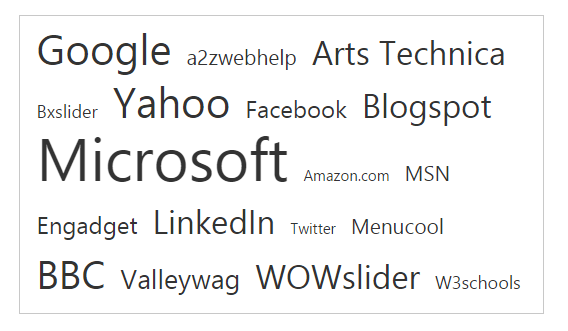
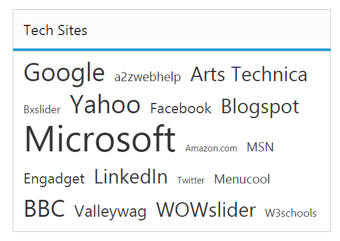
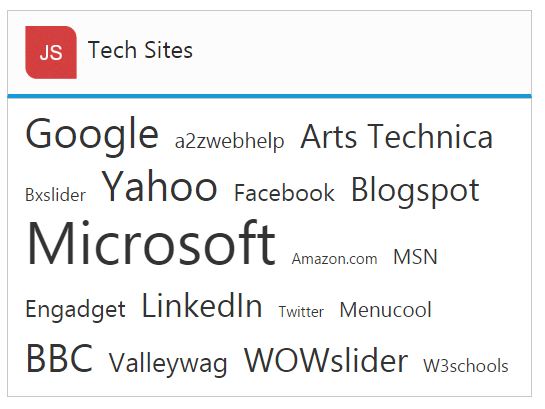

# Title Customization

## Show title

The **TagCloud** items are displayed with a Title element by default. To hide the title, you can use [showTitle](https://help.syncfusion.com/api/js/ejtagcloud#members:showtitle) property that is true by default.

### How to disable title in TagCloud

Refer to the below code to disable the title in TagCloud.



<ej-tagcloud id="tag" titleText="Popular Sites" [dataSource]="list" [showTitle]="false"></ej-tagcloud>





import {Component} from '@angular/core';
@Component({
    selector: 'ej-app',
    templateUrl: 'app/components/TagCloud/TagCloud.component.html'
    })
export class TagCloudComponent {
    list: array;
    constructor() {
    this.list = [
    { text: "Google", url: "http://www.google.co.in", frequency: 12 },
    { text: "a2zwebhelp", url: "http://www.a2zwebhelp.com", frequency: 3 },
    { text: "Arts Technica", url: "http://arstechnica.com/", frequency: 8 },
    { text: "slider", url: "http://bxslider.com/examples", frequency: 2 },
    { text: "Yahoo", url: "http://in.yahoo.com/", frequency: 12 },
    { text: "Facebook", url: "https://www.facebook.com/", frequency: 5 },
    { text: "Blogs", url: "http://www.blogspot.com/", frequency: 8 },
    { text: "Microsoft", url: "http://www.microsoft.com/", frequency: 20 },
    { text: "Amazon.com", url: "http://www.amazon.com/", frequency: 1 },
    { text: "MSN", url: "http://www.msn.com/", frequency: 3 },
    { text: "Engadget", url: "http://www.engadget.com/", frequency: 5 },
    { text: "LinkedIn", url: "http://www.linkedIn.com/", frequency: 9 },
    { text: "Twitter", url: "http://www.Twitter.com/", frequency: 0 },
    { text: "Menu", url: "http://www.menucool.com", frequency: 3 },
    { text: "BBC", url: "http://www.bbc.co.uk/", frequency: 11 },
    { text: "Valley", url: "http://valleywag.gawker.com/", frequency: 6 },
    { text: "WOWslider", url: "http://wowslider.com", frequency: 9 },
    { text: "W3schools", url: "http://www.w3schools.com/", frequency: 2 }
    ];
    }
}



The following screenshot illustrates a **TagCloud** control when you disable title,

 

## Title text

**TagCloud** widget allows you to set a custom title text by using the [titleText](https://help.syncfusion.com/api/js/ejtagcloud#members:titletext) property. By default titleText property is set to string value "Title".

### Defining title text for TagCloud

The following code helps you that how to configure **titleText** for a **TagCloud**.



<ej-tagcloud id="tag" [dataSource]="list" [showTitle]="true" [titleText]="title"></ej-tagcloud>





import {Component} from '@angular/core';
@Component({
    selector: 'ej-app',
    templateUrl: 'app/components/TagCloud/TagCloud.component.html'
    })
export class TagCloudComponent {
    list: array;
    title: string;
    constructor() {
    this.list = [
    { text: "Google", url: "http://www.google.co.in", frequency: 12 },
    { text: "a2zwebhelp", url: "http://www.a2zwebhelp.com", frequency: 3 },
    { text: "Arts Technica", url: "http://arstechnica.com/", frequency: 8 },
    { text: "slider", url: "http://bxslider.com/examples", frequency: 2 },
    { text: "Yahoo", url: "http://in.yahoo.com/", frequency: 12 },
    { text: "Facebook", url: "https://www.facebook.com/", frequency: 5 },
    { text: "Blogs", url: "http://www.blogspot.com/", frequency: 8 },
    { text: "Microsoft", url: "http://www.microsoft.com/", frequency: 20 },
    { text: "Amazon.com", url: "http://www.amazon.com/", frequency: 1 },
    { text: "MSN", url: "http://www.msn.com/", frequency: 3 },
    { text: "Engadget", url: "http://www.engadget.com/", frequency: 5 },
    { text: "LinkedIn", url: "http://www.linkedIn.com/", frequency: 9 },
    { text: "Twitter", url: "http://www.Twitter.com/", frequency: 0 },
    { text: "Menu", url: "http://www.menucool.com", frequency: 3 },
    { text: "BBC", url: "http://www.bbc.co.uk/", frequency: 11 },
    { text: "Valley", url: "http://valleywag.gawker.com/", frequency: 6 },
    { text: "Slider", url: "http://wowslider.com", frequency: 9 },
    { text: "W3schools", url: "http://www.w3schools.com/", frequency: 2 }
    ];
    this.title = "Tech Sites";
    }
}



The following screenshot illustrates the **TagCloud** control with customized title text.

## Title image

**TagCloud** widget provides **titleImage** to set an image for the title. You can set the desired image **URL** to [titleImage](https://help.syncfusion.com/api/js/ejtagcloud#members:titleimage) property.

### Defining title text for TagCloud

The following steps explains you to configure **titleImage** for a **TagCloud**.

Refer to the below code to configure the title image in TagCloud.



<ej-tagcloud id="tag" [dataSource]="list" [titleImage]="image" [titleText]="title"></ej-tagcloud>





import {Component} from '@angular/core';
import {ViewEncapsulation} from '@angular/core'; 
@Component({
    selector: 'ej-app',
    templateUrl: 'app/components/TagCloud/TagCloud.component.html',
    styleUrls: ['app/components/TagCloud/TagCloud.component.css'],
    encapsulation: ViewEncapsulation.None
    })
export class TagCloudComponent {
    list: array;
    title: string;
    image: string;
    constructor() {
    this.list = [
    { text: "Google", url: "http://www.google.co.in", frequency: 12 },
    { text: "a2zwebhelp", url: "http://www.a2zwebhelp.com", frequency: 3 },
    { text: "Arts Technica", url: "http://arstechnica.com/", frequency: 8 },
    { text: "slider", url: "http://bxslider.com/examples", frequency: 2 },
    { text: "Yahoo", url: "http://in.yahoo.com/", frequency: 12 },
    { text: "Facebook", url: "https://www.facebook.com/", frequency: 5 },
    { text: "Blogs", url: "http://www.blogspot.com/", frequency: 8 },
    { text: "Microsoft", url: "http://www.microsoft.com/", frequency: 20 },
    { text: "Amazon.com", url: "http://www.amazon.com/", frequency: 1 },
    { text: "MSN", url: "http://www.msn.com/", frequency: 3 },
    { text: "Engadget", url: "http://www.engadget.com/", frequency: 5 },
    { text: "LinkedIn", url: "http://www.linkedIn.com/", frequency: 9 },
    { text: "Twitter", url: "http://www.Twitter.com/", frequency: 0 },
    { text: "Menu", url: "http://www.menucool.com", frequency: 3 },
    { text: "BBC", url: "http://www.bbc.co.uk/", frequency: 11 },
    { text: "Valley", url: "http://valleywag.gawker.com/", frequency: 6 },
    { text: "Slider", url: "http://wowslider.com", frequency: 9 },
    { text: "W3schools", url: "http://www.w3schools.com/", frequency: 2 }
    ];
    this.title = "Tech Sites";
    this.image = "http://js.syncfusion.com/demos/web/images/waitingpopup/js_logo.png";
    }
}



Add the below style in TagCloud.component.css file.



.e-title-img {
    height:35px;
    width:35px;
}



The following screenshot illustrates the **TagCloud** control with customized title image.

