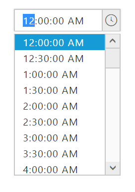

# Time Format in Angular TimePicker

**TimePicker** widget provides you an option to change the time format.

## Steps to change Time Format of TimePicker widget

The following steps explains you to change the time format for the **TimePicker**.

In the **HTML** page, add a **&lt;input&gt;** element to configure **TimePicker** widget.



    

    <input type="text" ej-timepicker [(ngModel)]="value" timeFormat="h:mm:ss tt"/>
    





import { Component } from '@angular/core';
@Component({
  selector: 'ej-app',
  templateUrl: './default.component.html'
})
export class DefaultComponent {

}



Execute the above code to render the following output.

 

